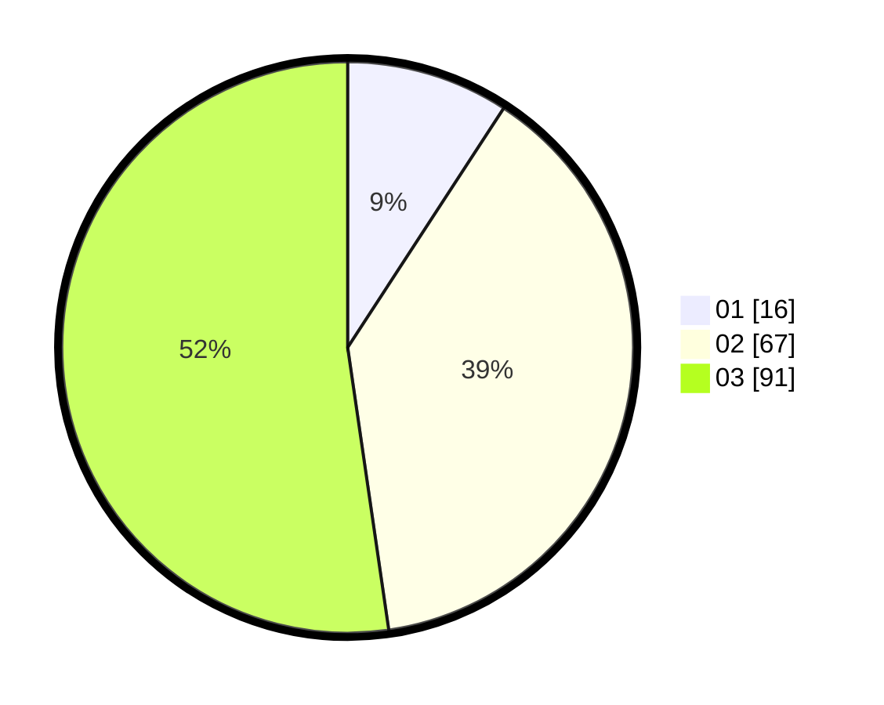

# Hasil

Hasil perolehan suara paslon dapat dilihat pada file paslon-01.txt, paslon-02.txt, dan paslon-03.txt.

Jika tidak ada, artinya data tersebut belum ada pada SIREKAP.

## Perolehan Suara

 * Paslon 01: **16**.
 * Paslon 02: **67**.
 * Paslon 03: **91**.

## Foto C Plano

https://sirekap-obj-formc.kpu.go.id/63ab/pemilu/ppwp/31/74/02/10/06/3174021006041-20240214-194631--53e76b6a-ddbf-4c61-af01-7a5332ad0ad1.jpg

https://sirekap-obj-formc.kpu.go.id/63ab/pemilu/ppwp/31/74/02/10/06/3174021006041-20240214-194703--72db850e-4e29-45c4-bffb-2d92190d7641.jpg

https://sirekap-obj-formc.kpu.go.id/63ab/pemilu/ppwp/31/74/02/10/06/3174021006041-20240214-194722--489fdcd8-d0d8-46ce-983d-154e9bdf7714.jpg

## DATA PEMILIH TETAP

Jumlah pemilih dalam DPT: **209**.
 * L: **91**.
 * P: **118**.

## DATA PENGGUNA HAK PILIH

Jumlah pengguna hak pilih dalam DPT: **163**.
 * L: **72**.
 * P: **91**.

Jumlah pengguna hak pilih dalam DPTb: **13**.
 * L: **4**.
 * P: **9**.

Jumlah pengguna hak pilih dalam DPK: **0**.
 * L: **0**.
 * P: **0**.

Jumlah pengguna hak pilih: **176**.
 * L: **76**.
 * P: **100**.

## JUMLAH SUARA SAH DAN TIDAK SAH

JUMLAH SELURUH SUARA SAH: **174**.

JUMLAH SUARA TIDAK SAH: **2**.

JUMLAH SELURUH SUARA SAH DAN SUARA TIDAK SAH: **176**.
