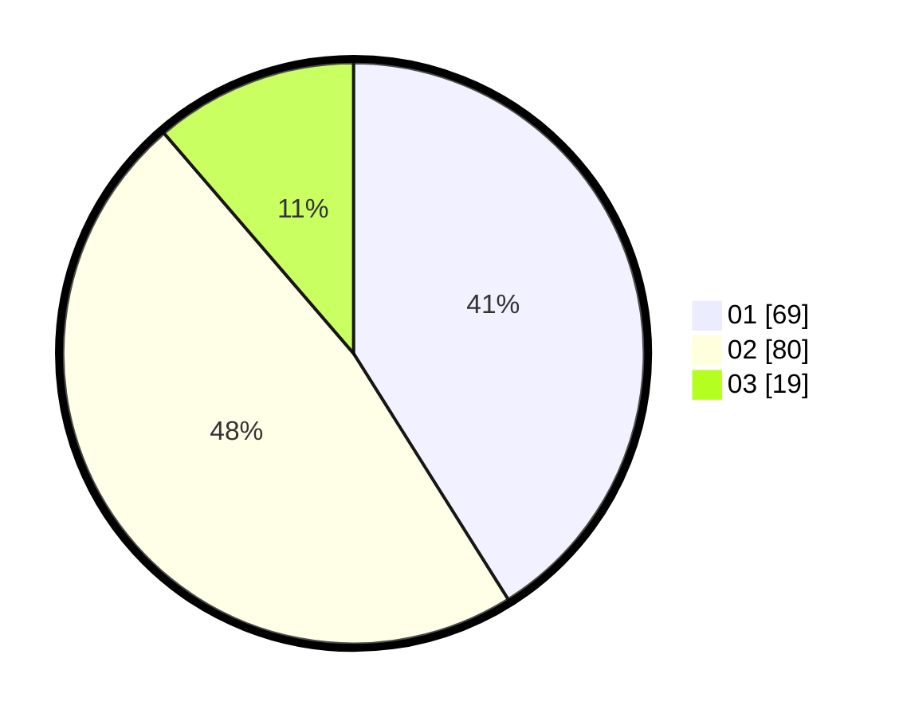

# Hasil

Hasil perolehan suara paslon dapat dilihat pada file paslon-01.txt, paslon-02.txt, dan paslon-03.txt.

Jika tidak ada, artinya data tersebut belum ada pada SIREKAP.

## Perolehan Suara

 * Paslon 01: **69**.
 * Paslon 02: **80**.
 * Paslon 03: **19**.

## Foto C Plano

https://sirekap-obj-formc.kpu.go.id/fe68/pemilu/ppwp/31/74/02/10/06/3174021006058-20240214-220640--38cdeb7c-9bb0-441b-aa2f-07622780ad49.jpg

https://sirekap-obj-formc.kpu.go.id/fe68/pemilu/ppwp/31/74/02/10/06/3174021006058-20240214-220729--1a54988f-81ed-485a-b54c-d9b7e6418418.jpg

https://sirekap-obj-formc.kpu.go.id/fe68/pemilu/ppwp/31/74/02/10/06/3174021006058-20240214-220845--dc0a0e71-db85-4fcf-ae97-5a1ebe04ac0a.jpg

## DATA PEMILIH TETAP

Jumlah pemilih dalam DPT: **201**.
 * L: **103**.
 * P: **98**.

## DATA PENGGUNA HAK PILIH

Jumlah pengguna hak pilih dalam DPT: **158**.
 * L: **80**.
 * P: **78**.

Jumlah pengguna hak pilih dalam DPTb: **12**.
 * L: **7**.
 * P: **5**.

Jumlah pengguna hak pilih dalam DPK: **0**.
 * L: **0**.
 * P: **0**.

Jumlah pengguna hak pilih: **170**.
 * L: **87**.
 * P: **83**.

## JUMLAH SUARA SAH DAN TIDAK SAH

JUMLAH SELURUH SUARA SAH: **168**.

JUMLAH SUARA TIDAK SAH: **2**.

JUMLAH SELURUH SUARA SAH DAN SUARA TIDAK SAH: **170**.
