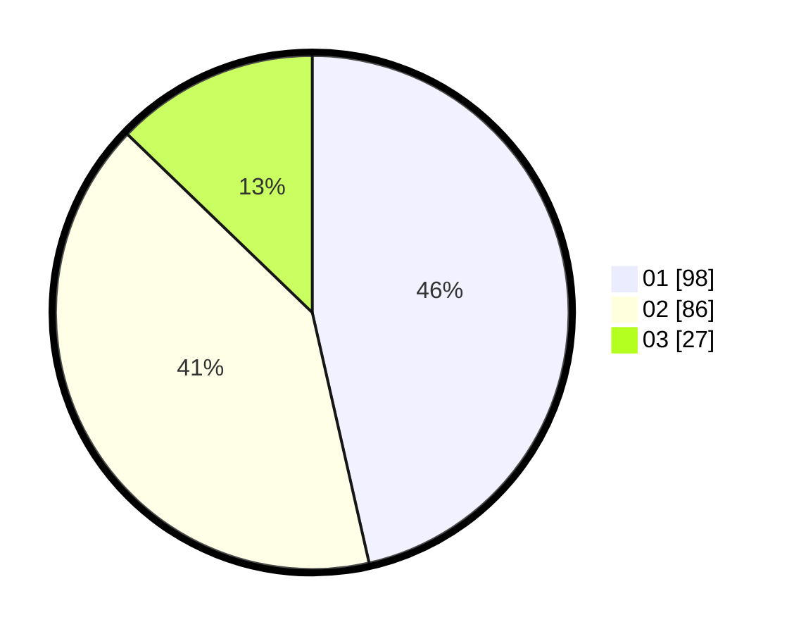

# Hasil

Hasil perolehan suara paslon dapat dilihat pada file paslon-01.txt, paslon-02.txt, dan paslon-03.txt.

Jika tidak ada, artinya data tersebut belum ada pada SIREKAP.

## Perolehan Suara

 * Paslon 01: **98**.
 * Paslon 02: **86**.
 * Paslon 03: **27**.

## Foto C Plano

https://sirekap-obj-formc.kpu.go.id/85d7/pemilu/ppwp/31/74/02/10/06/3174021006067-20240214-191711--e92a1e58-bec3-458c-8d2b-da47097f7fec.jpg

https://sirekap-obj-formc.kpu.go.id/85d7/pemilu/ppwp/31/74/02/10/06/3174021006067-20240214-193212--1a46e59a-ca83-446b-a380-a92f1c0b5604.jpg

https://sirekap-obj-formc.kpu.go.id/85d7/pemilu/ppwp/31/74/02/10/06/3174021006067-20240214-211922--3a3dec82-1c96-42b6-a51d-2ba724927fd0.jpg

## DATA PEMILIH TETAP

Jumlah pemilih dalam DPT: **250**.
 * L: **118**.
 * P: **132**.

## DATA PENGGUNA HAK PILIH

Jumlah pengguna hak pilih dalam DPT: **210**.
 * L: **99**.
 * P: **111**.

Jumlah pengguna hak pilih dalam DPTb: **3**.
 * L: **2**.
 * P: **1**.

Jumlah pengguna hak pilih dalam DPK: **1**.
 * L: **1**.
 * P: **0**.

Jumlah pengguna hak pilih: **214**.
 * L: **102**.
 * P: **112**.

## JUMLAH SUARA SAH DAN TIDAK SAH

JUMLAH SELURUH SUARA SAH: **211**.

JUMLAH SUARA TIDAK SAH: **3**.

JUMLAH SELURUH SUARA SAH DAN SUARA TIDAK SAH: **214**.
