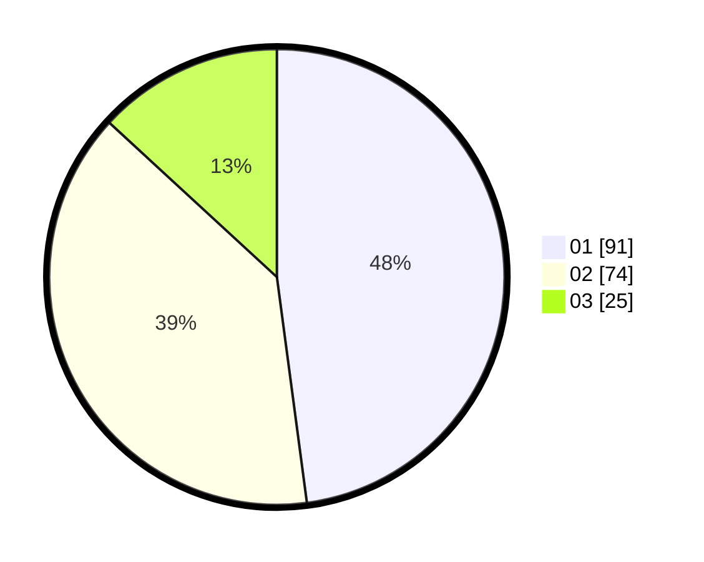

# Hasil

Hasil perolehan suara paslon dapat dilihat pada file paslon-01.txt, paslon-02.txt, dan paslon-03.txt.

Jika tidak ada, artinya data tersebut belum ada pada SIREKAP.

## Perolehan Suara

 * Paslon 01: **91**.
 * Paslon 02: **74**.
 * Paslon 03: **25**.

## Foto C Plano

https://sirekap-obj-formc.kpu.go.id/936f/pemilu/ppwp/31/74/02/10/06/3174021006073-20240214-155101--4599c11a-5642-4a44-9fe4-85a4c525b725.jpg

https://sirekap-obj-formc.kpu.go.id/936f/pemilu/ppwp/31/74/02/10/06/3174021006073-20240214-155407--72538c88-02cb-43ed-a90b-aaf961b0a0b9.jpg

https://sirekap-obj-formc.kpu.go.id/936f/pemilu/ppwp/31/74/02/10/06/3174021006073-20240214-155859--488ceedf-1dec-4812-a6d7-93fe20c27103.jpg

## DATA PEMILIH TETAP

Jumlah pemilih dalam DPT: **262**.
 * L: **137**.
 * P: **125**.

## DATA PENGGUNA HAK PILIH

Jumlah pengguna hak pilih dalam DPT: **183**.
 * L: **90**.
 * P: **93**.

Jumlah pengguna hak pilih dalam DPTb: **7**.
 * L: **2**.
 * P: **5**.

Jumlah pengguna hak pilih dalam DPK: **0**.
 * L: **0**.
 * P: **0**.

Jumlah pengguna hak pilih: **190**.
 * L: **92**.
 * P: **98**.

## JUMLAH SUARA SAH DAN TIDAK SAH

JUMLAH SELURUH SUARA SAH: **190**.

JUMLAH SUARA TIDAK SAH: **0**.

JUMLAH SELURUH SUARA SAH DAN SUARA TIDAK SAH: **190**.
