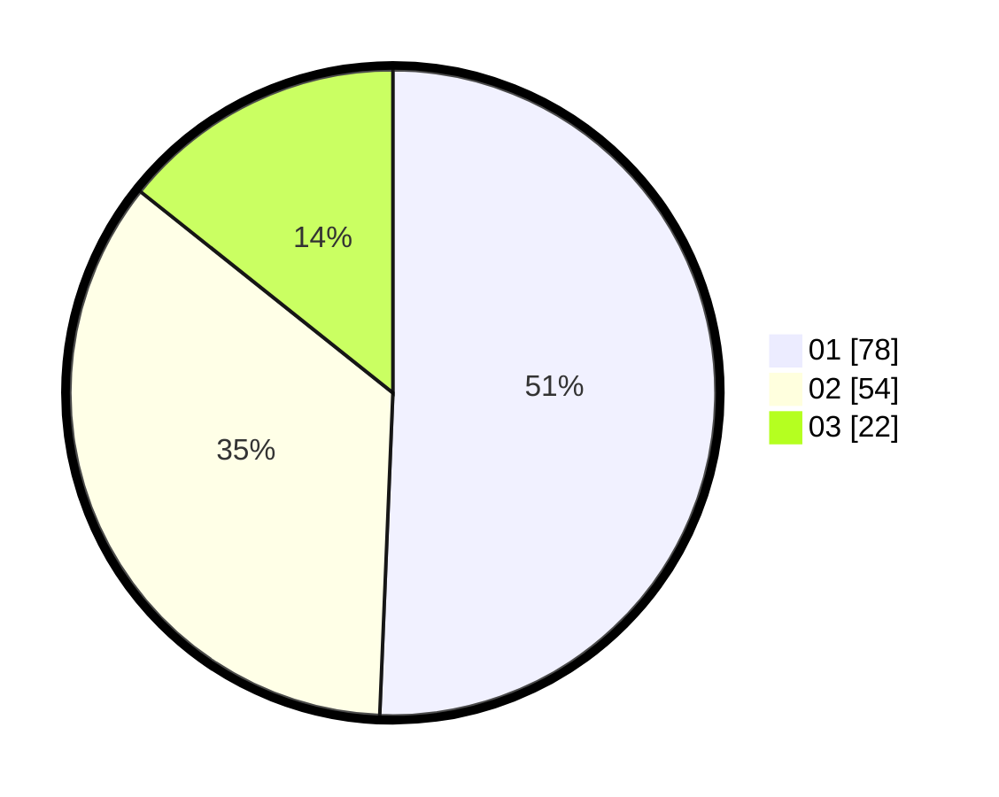

# Hasil

Hasil perolehan suara paslon dapat dilihat pada file paslon-01.txt, paslon-02.txt, dan paslon-03.txt.

Jika tidak ada, artinya data tersebut belum ada pada SIREKAP.

## Perolehan Suara

 * Paslon 01: **78**.
 * Paslon 02: **54**.
 * Paslon 03: **22**.

## Foto C Plano

https://sirekap-obj-formc.kpu.go.id/c849/pemilu/ppwp/31/74/02/10/06/3174021006074-20240218-224718--534c88d9-6514-4280-86ed-040dd1e1cf43.jpg

https://sirekap-obj-formc.kpu.go.id/c849/pemilu/ppwp/31/74/02/10/06/3174021006074-20240218-224346--5dbd749e-49b0-4fbb-8a55-14305facbe3f.jpg

https://sirekap-obj-formc.kpu.go.id/c849/pemilu/ppwp/31/74/02/10/06/3174021006074-20240218-235340--615e4bd9-8a2b-4b20-b983-1433237e33e9.jpg
