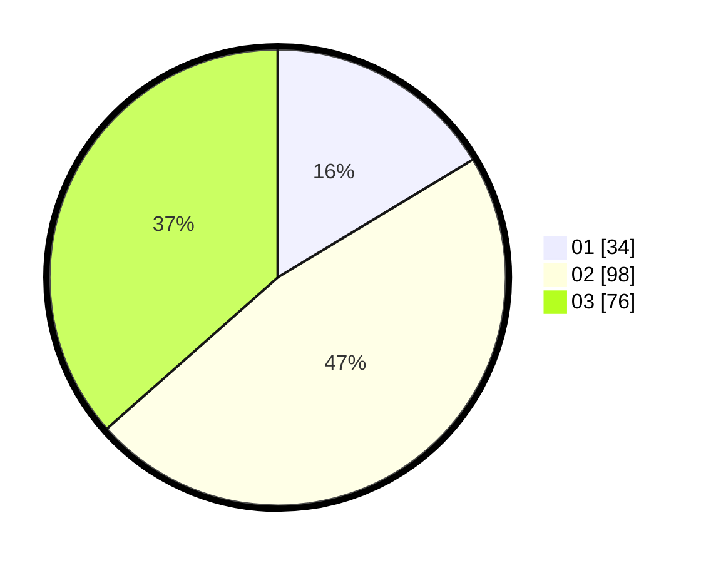

# Hasil

Hasil perolehan suara paslon dapat dilihat pada file paslon-01.txt, paslon-02.txt, dan paslon-03.txt.

Jika tidak ada, artinya data tersebut belum ada pada SIREKAP.

## Perolehan Suara

 * Paslon 01: **34**.
 * Paslon 02: **98**.
 * Paslon 03: **76**.

## Foto C Plano

https://sirekap-obj-formc.kpu.go.id/2039/pemilu/ppwp/31/74/02/10/07/3174021007007-20240215-091813--10ef6b71-6ebd-4388-9aed-336ccc343e76.jpg

https://sirekap-obj-formc.kpu.go.id/2039/pemilu/ppwp/31/74/02/10/07/3174021007007-20240215-091834--4349c33f-4bbd-4c5c-8063-926e064bb1c3.jpg

https://sirekap-obj-formc.kpu.go.id/2039/pemilu/ppwp/31/74/02/10/07/3174021007007-20240215-091824--a3321735-ab1c-478f-a19a-5411bfe32fae.jpg

## DATA PEMILIH TETAP

Jumlah pemilih dalam DPT: **257**.
 * L: **113**.
 * P: **144**.

## DATA PENGGUNA HAK PILIH

Jumlah pengguna hak pilih dalam DPT: **189**.
 * L: **82**.
 * P: **107**.

Jumlah pengguna hak pilih dalam DPTb: **17**.
 * L: **6**.
 * P: **11**.

Jumlah pengguna hak pilih dalam DPK: **4**.
 * L: **2**.
 * P: **2**.

Jumlah pengguna hak pilih: **210**.
 * L: **90**.
 * P: **120**.

## JUMLAH SUARA SAH DAN TIDAK SAH

JUMLAH SELURUH SUARA SAH: **208**.

JUMLAH SUARA TIDAK SAH: **2**.

JUMLAH SELURUH SUARA SAH DAN SUARA TIDAK SAH: **210**.
