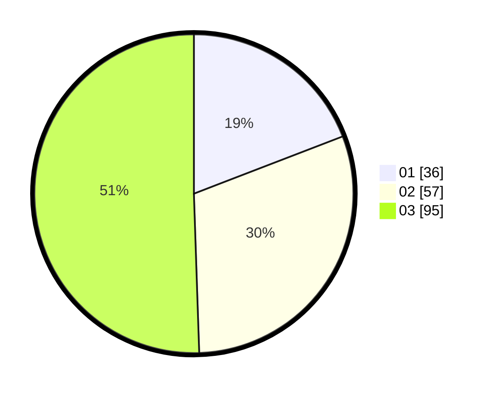

# Hasil

Hasil perolehan suara paslon dapat dilihat pada file paslon-01.txt, paslon-02.txt, dan paslon-03.txt.

Jika tidak ada, artinya data tersebut belum ada pada SIREKAP.

## Perolehan Suara

 * Paslon 01: **36**.
 * Paslon 02: **57**.
 * Paslon 03: **95**.

## Foto C Plano

https://sirekap-obj-formc.kpu.go.id/fdc0/pemilu/ppwp/31/74/02/10/08/3174021008007-20240214-155257--497cd082-edd1-4d8c-959b-8afd68ac1cb7.jpg

https://sirekap-obj-formc.kpu.go.id/fdc0/pemilu/ppwp/31/74/02/10/08/3174021008007-20240214-160101--5b642a69-8522-4af3-ae50-ca49927a85ef.jpg

https://sirekap-obj-formc.kpu.go.id/fdc0/pemilu/ppwp/31/74/02/10/08/3174021008007-20240214-160142--dcb4814e-8a02-4ae2-b09e-05fda08d897d.jpg

## DATA PEMILIH TETAP

Jumlah pemilih dalam DPT: **248**.
 * L: **114**.
 * P: **134**.

## DATA PENGGUNA HAK PILIH

Jumlah pengguna hak pilih dalam DPT: **168**.
 * L: **77**.
 * P: **91**.

Jumlah pengguna hak pilih dalam DPTb: **15**.
 * L: **6**.
 * P: **9**.

Jumlah pengguna hak pilih dalam DPK: **6**.
 * L: **4**.
 * P: **2**.

Jumlah pengguna hak pilih: **189**.
 * L: **87**.
 * P: **102**.

## JUMLAH SUARA SAH DAN TIDAK SAH

JUMLAH SELURUH SUARA SAH: **188**.

JUMLAH SUARA TIDAK SAH: **1**.

JUMLAH SELURUH SUARA SAH DAN SUARA TIDAK SAH: **189**.
