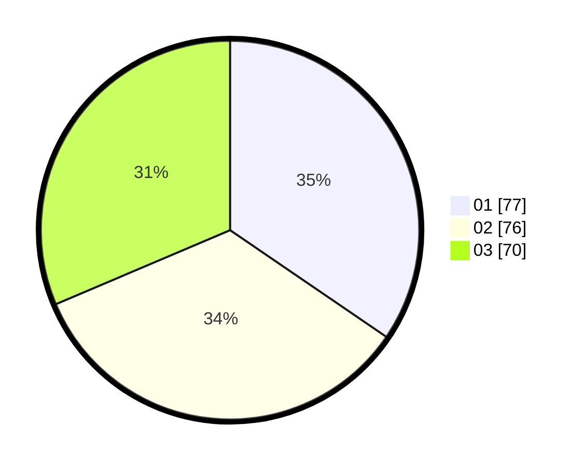

# Hasil

Hasil perolehan suara paslon dapat dilihat pada file paslon-01.txt, paslon-02.txt, dan paslon-03.txt.

Jika tidak ada, artinya data tersebut belum ada pada SIREKAP.

## Perolehan Suara

 * Paslon 01: **77**.
 * Paslon 02: **76**.
 * Paslon 03: **70**.

## Foto C Plano

https://sirekap-obj-formc.kpu.go.id/02ae/pemilu/ppwp/31/74/02/10/08/3174021008012-20240214-212800--538c2681-900c-4859-b4a7-6fde5109dab8.jpg

https://sirekap-obj-formc.kpu.go.id/02ae/pemilu/ppwp/31/74/02/10/08/3174021008012-20240214-213915--153f62aa-5814-41f5-94c7-935ebfb7e02d.jpg

https://sirekap-obj-formc.kpu.go.id/02ae/pemilu/ppwp/31/74/02/10/08/3174021008012-20240214-214405--19debb26-89ee-47ae-99ae-fb6dfdd87373.jpg

## DATA PEMILIH TETAP

Jumlah pemilih dalam DPT: **292**.
 * L: **145**.
 * P: **147**.

## DATA PENGGUNA HAK PILIH

Jumlah pengguna hak pilih dalam DPT: **218**.
 * L: **110**.
 * P: **108**.

Jumlah pengguna hak pilih dalam DPTb: **22**.
 * L: **6**.
 * P: **16**.

Jumlah pengguna hak pilih dalam DPK: **0**.
 * L: **0**.
 * P: **0**.

Jumlah pengguna hak pilih: **240**.
 * L: **116**.
 * P: **124**.

## JUMLAH SUARA SAH DAN TIDAK SAH

JUMLAH SELURUH SUARA SAH: **223**.

JUMLAH SUARA TIDAK SAH: **17**.

JUMLAH SELURUH SUARA SAH DAN SUARA TIDAK SAH: **240**.
