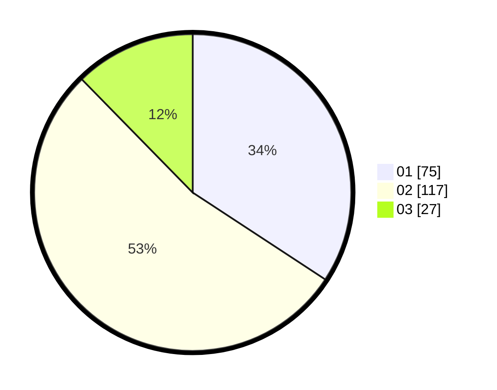

# Hasil

Hasil perolehan suara paslon dapat dilihat pada file paslon-01.txt, paslon-02.txt, dan paslon-03.txt.

Jika tidak ada, artinya data tersebut belum ada pada SIREKAP.

## Perolehan Suara

 * Paslon 01: **75**.
 * Paslon 02: **117**.
 * Paslon 03: **27**.

## Foto C Plano

https://sirekap-obj-formc.kpu.go.id/ccd7/pemilu/ppwp/31/74/03/10/01/3174031001014-20240215-052924--2e4e5eee-6f95-414c-9e5b-167638fb1ba9.jpg

https://sirekap-obj-formc.kpu.go.id/ccd7/pemilu/ppwp/31/74/03/10/01/3174031001014-20240215-052945--84dfc32c-14f2-46f6-b625-b318ef6905a3.jpg

https://sirekap-obj-formc.kpu.go.id/ccd7/pemilu/ppwp/31/74/03/10/01/3174031001014-20240215-052935--62540ea4-5174-4f0c-b8ae-58a0bbbae247.jpg

## DATA PEMILIH TETAP

Jumlah pemilih dalam DPT: **277**.
 * L: **136**.
 * P: **141**.

## DATA PENGGUNA HAK PILIH

Jumlah pengguna hak pilih dalam DPT: **205**.
 * L: **100**.
 * P: **105**.

Jumlah pengguna hak pilih dalam DPTb: **9**.
 * L: **3**.
 * P: **6**.

Jumlah pengguna hak pilih dalam DPK: **8**.
 * L: **4**.
 * P: **4**.

Jumlah pengguna hak pilih: **222**.
 * L: **107**.
 * P: **115**.

## JUMLAH SUARA SAH DAN TIDAK SAH

JUMLAH SELURUH SUARA SAH: **219**.

JUMLAH SUARA TIDAK SAH: **3**.

JUMLAH SELURUH SUARA SAH DAN SUARA TIDAK SAH: **222**.
