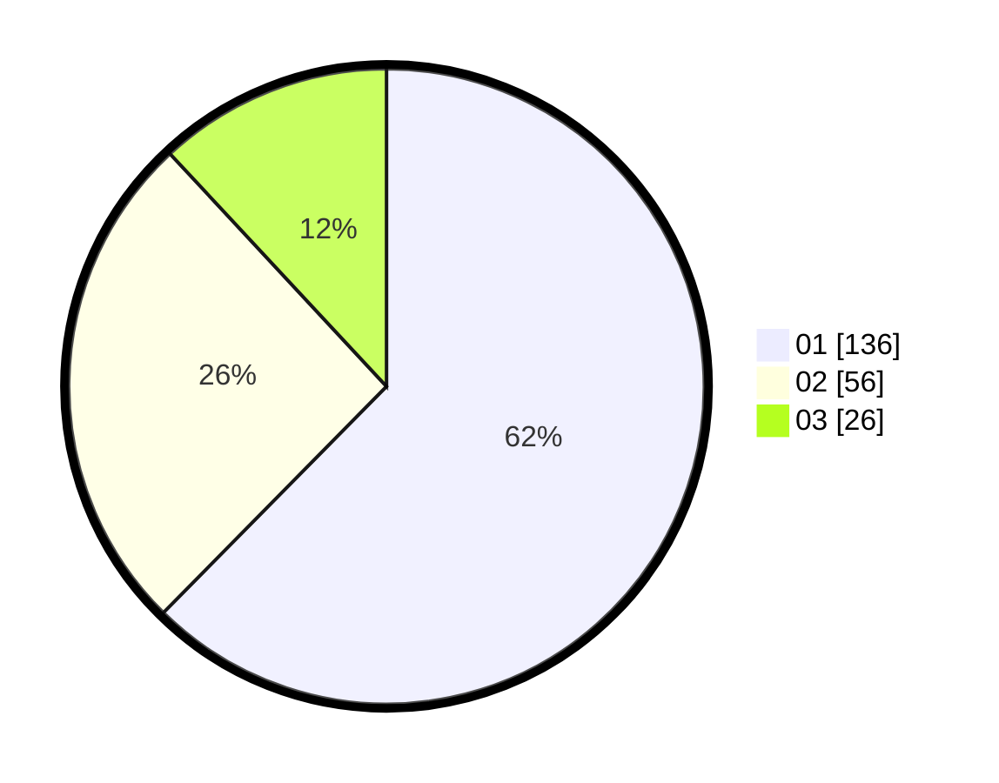

# Hasil

Hasil perolehan suara paslon dapat dilihat pada file paslon-01.txt, paslon-02.txt, dan paslon-03.txt.

Jika tidak ada, artinya data tersebut belum ada pada SIREKAP.

## Perolehan Suara

 * Paslon 01: **136**.
 * Paslon 02: **56**.
 * Paslon 03: **26**.

## Foto C Plano

https://sirekap-obj-formc.kpu.go.id/42b7/pemilu/ppwp/31/74/03/10/01/3174031001027-20240214-190121--350464a2-6dc0-45dc-918b-28798a170282.jpg

https://sirekap-obj-formc.kpu.go.id/42b7/pemilu/ppwp/31/74/03/10/01/3174031001027-20240214-195356--3c384e9e-394b-42b6-9275-c86d6bc4812b.jpg

https://sirekap-obj-formc.kpu.go.id/42b7/pemilu/ppwp/31/74/03/10/01/3174031001027-20240214-195450--781c3345-912d-4d96-8aeb-c958db931542.jpg

## DATA PEMILIH TETAP

Jumlah pemilih dalam DPT: **262**.
 * L: **124**.
 * P: **138**.

## DATA PENGGUNA HAK PILIH

Jumlah pengguna hak pilih dalam DPT: **206**.
 * L: **101**.
 * P: **105**.

Jumlah pengguna hak pilih dalam DPTb: **13**.
 * L: **6**.
 * P: **7**.

Jumlah pengguna hak pilih dalam DPK: **0**.
 * L: **0**.
 * P: **0**.

Jumlah pengguna hak pilih: **219**.
 * L: **107**.
 * P: **112**.

## JUMLAH SUARA SAH DAN TIDAK SAH

JUMLAH SELURUH SUARA SAH: **218**.

JUMLAH SUARA TIDAK SAH: **1**.

JUMLAH SELURUH SUARA SAH DAN SUARA TIDAK SAH: **219**.
