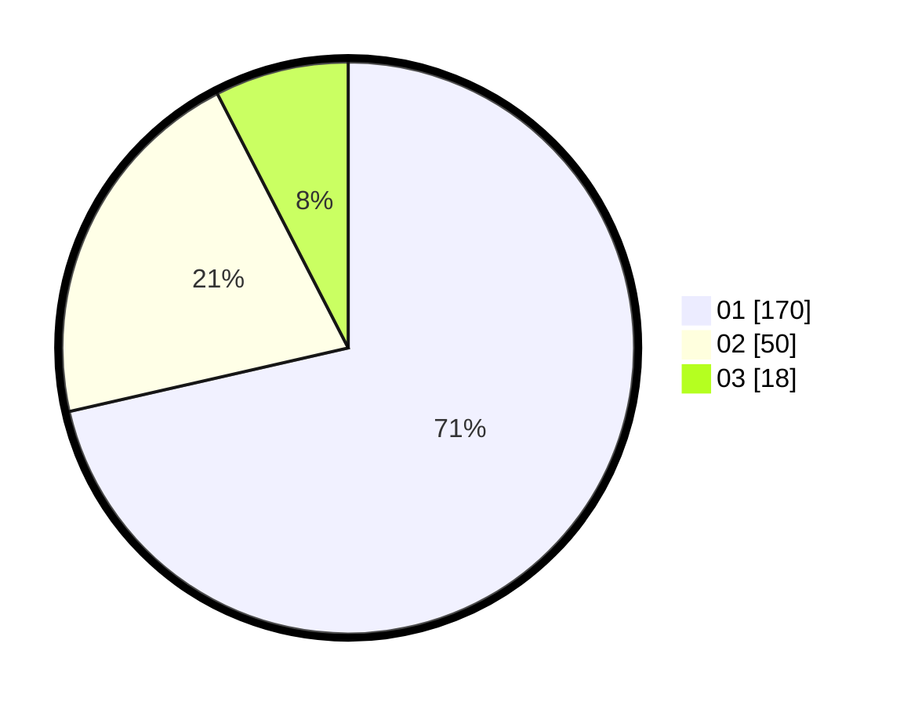

# Hasil

Hasil perolehan suara paslon dapat dilihat pada file paslon-01.txt, paslon-02.txt, dan paslon-03.txt.

Jika tidak ada, artinya data tersebut belum ada pada SIREKAP.

## Perolehan Suara

 * Paslon 01: **170**.
 * Paslon 02: **50**.
 * Paslon 03: **18**.

## Foto C Plano

https://sirekap-obj-formc.kpu.go.id/d993/pemilu/ppwp/31/74/03/10/01/3174031001028-20240215-003726--580846ed-df1d-4ea6-911b-80bec0f19f55.jpg

https://sirekap-obj-formc.kpu.go.id/d993/pemilu/ppwp/31/74/03/10/01/3174031001028-20240215-003918--abedca5f-1d08-4e72-93a1-0657e652c69d.jpg

https://sirekap-obj-formc.kpu.go.id/d993/pemilu/ppwp/31/74/03/10/01/3174031001028-20240215-004033--6ff5eb28-cd63-48b4-8a75-91f2cd6a0fc3.jpg
