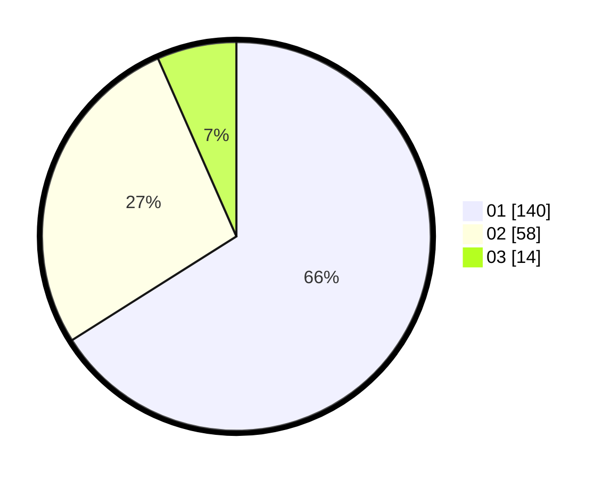

# Hasil

Hasil perolehan suara paslon dapat dilihat pada file paslon-01.txt, paslon-02.txt, dan paslon-03.txt.

Jika tidak ada, artinya data tersebut belum ada pada SIREKAP.

## Perolehan Suara

 * Paslon 01: **140**.
 * Paslon 02: **58**.
 * Paslon 03: **14**.

## Foto C Plano

https://sirekap-obj-formc.kpu.go.id/5234/pemilu/ppwp/31/74/03/10/01/3174031001032-20240215-134828--c19f8a58-5db3-4197-8253-59847c303861.jpg

https://sirekap-obj-formc.kpu.go.id/5234/pemilu/ppwp/31/74/03/10/01/3174031001032-20240215-134853--e9d53032-0657-4e7b-96fd-b7630ea432f7.jpg

https://sirekap-obj-formc.kpu.go.id/5234/pemilu/ppwp/31/74/03/10/01/3174031001032-20240215-134842--5bc93229-0c57-4b7e-b88b-6883da577921.jpg

## DATA PEMILIH TETAP

Jumlah pemilih dalam DPT: **264**.
 * L: **139**.
 * P: **125**.

## DATA PENGGUNA HAK PILIH

Jumlah pengguna hak pilih dalam DPT: **207**.
 * L: **102**.
 * P: **105**.

Jumlah pengguna hak pilih dalam DPTb: **5**.
 * L: **4**.
 * P: **1**.

Jumlah pengguna hak pilih dalam DPK: **0**.
 * L: **0**.
 * P: **0**.

Jumlah pengguna hak pilih: **212**.
 * L: **106**.
 * P: **106**.

## JUMLAH SUARA SAH DAN TIDAK SAH

JUMLAH SELURUH SUARA SAH: **212**.

JUMLAH SUARA TIDAK SAH: **0**.

JUMLAH SELURUH SUARA SAH DAN SUARA TIDAK SAH: **212**.
