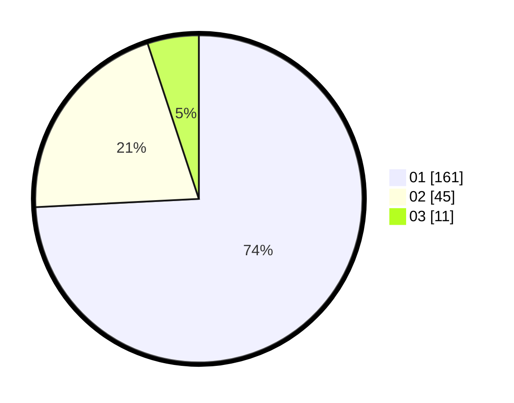

# Hasil

Hasil perolehan suara paslon dapat dilihat pada file paslon-01.txt, paslon-02.txt, dan paslon-03.txt.

Jika tidak ada, artinya data tersebut belum ada pada SIREKAP.

## Perolehan Suara

 * Paslon 01: **161**.
 * Paslon 02: **45**.
 * Paslon 03: **11**.

## Foto C Plano

https://sirekap-obj-formc.kpu.go.id/b9a2/pemilu/ppwp/31/74/03/10/01/3174031001033-20240214-231717--82c35bf6-8521-41e6-8a12-0f6e97b005a3.jpg

https://sirekap-obj-formc.kpu.go.id/b9a2/pemilu/ppwp/31/74/03/10/01/3174031001033-20240214-185741--bd9396e9-6842-4900-8413-3d86f7e5a485.jpg

https://sirekap-obj-formc.kpu.go.id/b9a2/pemilu/ppwp/31/74/03/10/01/3174031001033-20240214-185744--a2c22645-e020-4086-9d4e-eeabd81bac57.jpg

## DATA PEMILIH TETAP

Jumlah pemilih dalam DPT: **281**.
 * L: **141**.
 * P: **140**.

## DATA PENGGUNA HAK PILIH

Jumlah pengguna hak pilih dalam DPT: **214**.
 * L: **107**.
 * P: **107**.

Jumlah pengguna hak pilih dalam DPTb: **4**.
 * L: **2**.
 * P: **2**.

Jumlah pengguna hak pilih dalam DPK: **1**.
 * L: **1**.
 * P: **0**.

Jumlah pengguna hak pilih: **219**.
 * L: **110**.
 * P: **109**.

## JUMLAH SUARA SAH DAN TIDAK SAH

JUMLAH SELURUH SUARA SAH: **217**.

JUMLAH SUARA TIDAK SAH: **2**.

JUMLAH SELURUH SUARA SAH DAN SUARA TIDAK SAH: **219**.
