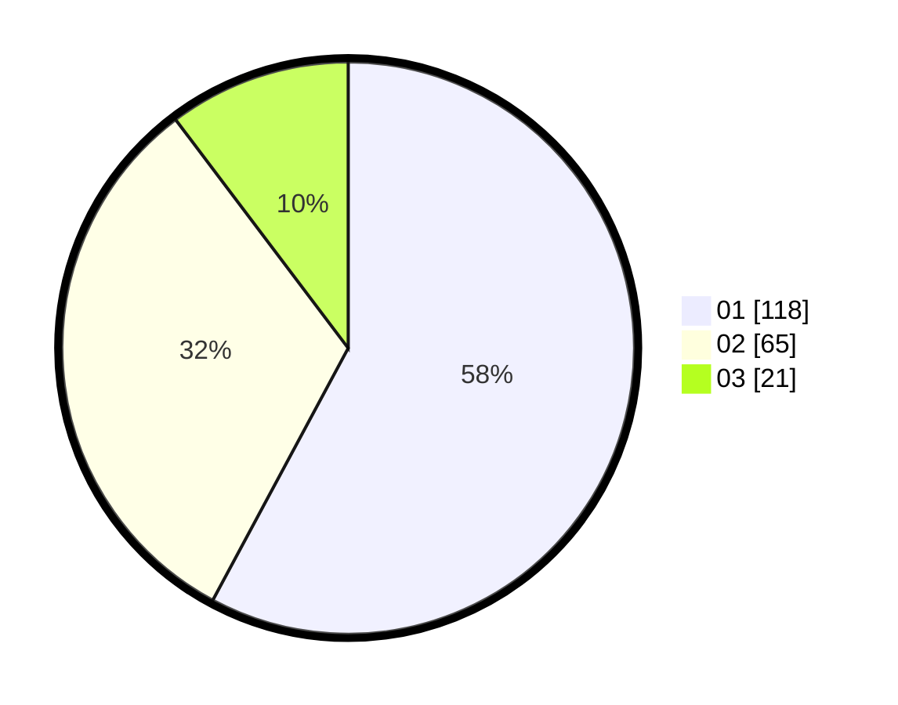

# Hasil

Hasil perolehan suara paslon dapat dilihat pada file paslon-01.txt, paslon-02.txt, dan paslon-03.txt.

Jika tidak ada, artinya data tersebut belum ada pada SIREKAP.

## Perolehan Suara

 * Paslon 01: **118**.
 * Paslon 02: **65**.
 * Paslon 03: **21**.

## Foto C Plano

https://sirekap-obj-formc.kpu.go.id/0c42/pemilu/ppwp/31/74/03/10/01/3174031001038-20240215-223729--931d2c98-9652-4f5f-8423-b667f73a115c.jpg

https://sirekap-obj-formc.kpu.go.id/0c42/pemilu/ppwp/31/74/03/10/01/3174031001038-20240215-223733--2344e211-2b98-467a-a95a-123300434f28.jpg

https://sirekap-obj-formc.kpu.go.id/0c42/pemilu/ppwp/31/74/03/10/01/3174031001038-20240215-223731--728027a1-7b17-483f-abaa-ef7340adc37e.jpg

## DATA PEMILIH TETAP

Jumlah pemilih dalam DPT: **258**.
 * L: **136**.
 * P: **122**.

## DATA PENGGUNA HAK PILIH

Jumlah pengguna hak pilih dalam DPT: **201**.
 * L: **108**.
 * P: **93**.

Jumlah pengguna hak pilih dalam DPTb: **2**.
 * L: **0**.
 * P: **2**.

Jumlah pengguna hak pilih dalam DPK: **4**.
 * L: **1**.
 * P: **3**.

Jumlah pengguna hak pilih: **207**.
 * L: **109**.
 * P: **98**.

## JUMLAH SUARA SAH DAN TIDAK SAH

JUMLAH SELURUH SUARA SAH: **204**.

JUMLAH SUARA TIDAK SAH: **3**.

JUMLAH SELURUH SUARA SAH DAN SUARA TIDAK SAH: **207**.
