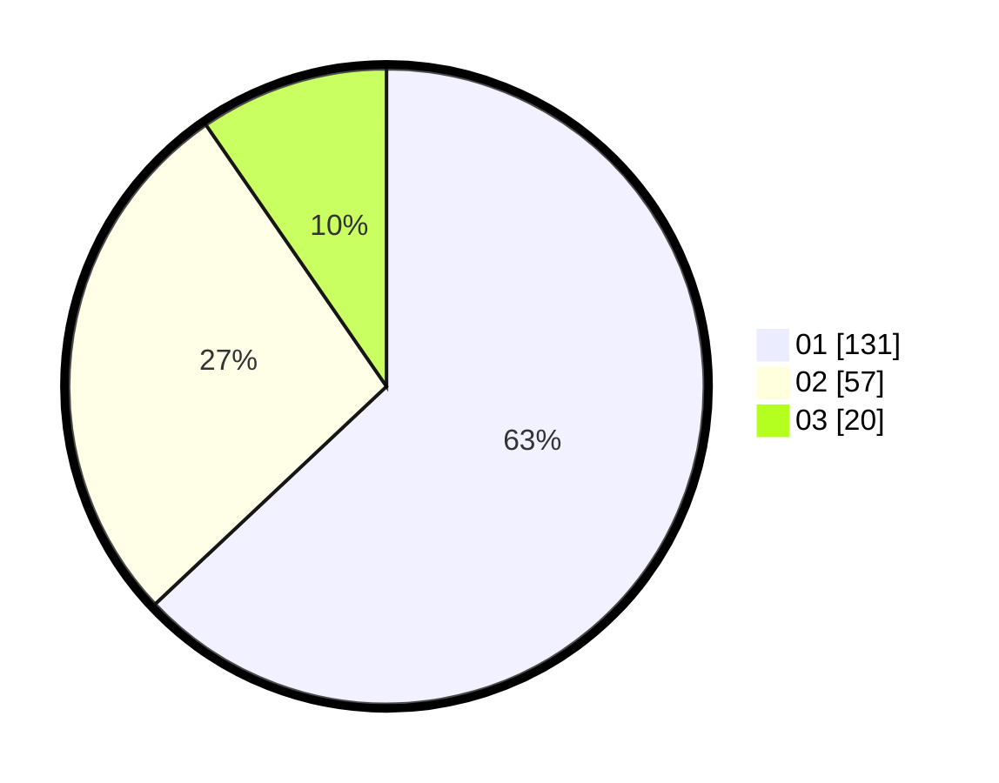

# Hasil

Hasil perolehan suara paslon dapat dilihat pada file paslon-01.txt, paslon-02.txt, dan paslon-03.txt.

Jika tidak ada, artinya data tersebut belum ada pada SIREKAP.

## Perolehan Suara

 * Paslon 01: **131**.
 * Paslon 02: **57**.
 * Paslon 03: **20**.

## Foto C Plano

https://sirekap-obj-formc.kpu.go.id/fedf/pemilu/ppwp/31/74/03/10/01/3174031001046-20240214-155234--c69a0065-fb91-4ade-9234-5f0be2d4a9a9.jpg

https://sirekap-obj-formc.kpu.go.id/fedf/pemilu/ppwp/31/74/03/10/01/3174031001046-20240214-155612--b04f06d4-cecc-48c5-b3a4-0af7c9c9e292.jpg

https://sirekap-obj-formc.kpu.go.id/fedf/pemilu/ppwp/31/74/03/10/01/3174031001046-20240214-202945--b45c1b02-86ed-4c6e-b342-a5dd646ef29b.jpg

## DATA PEMILIH TETAP

Jumlah pemilih dalam DPT: **245**.
 * L: **115**.
 * P: **130**.

## DATA PENGGUNA HAK PILIH

Jumlah pengguna hak pilih dalam DPT: **188**.
 * L: **84**.
 * P: **104**.

Jumlah pengguna hak pilih dalam DPTb: **15**.
 * L: **4**.
 * P: **11**.

Jumlah pengguna hak pilih dalam DPK: **6**.
 * L: **3**.
 * P: **3**.

Jumlah pengguna hak pilih: **209**.
 * L: **91**.
 * P: **118**.

## JUMLAH SUARA SAH DAN TIDAK SAH

JUMLAH SELURUH SUARA SAH: **208**.

JUMLAH SUARA TIDAK SAH: **1**.

JUMLAH SELURUH SUARA SAH DAN SUARA TIDAK SAH: **209**.
