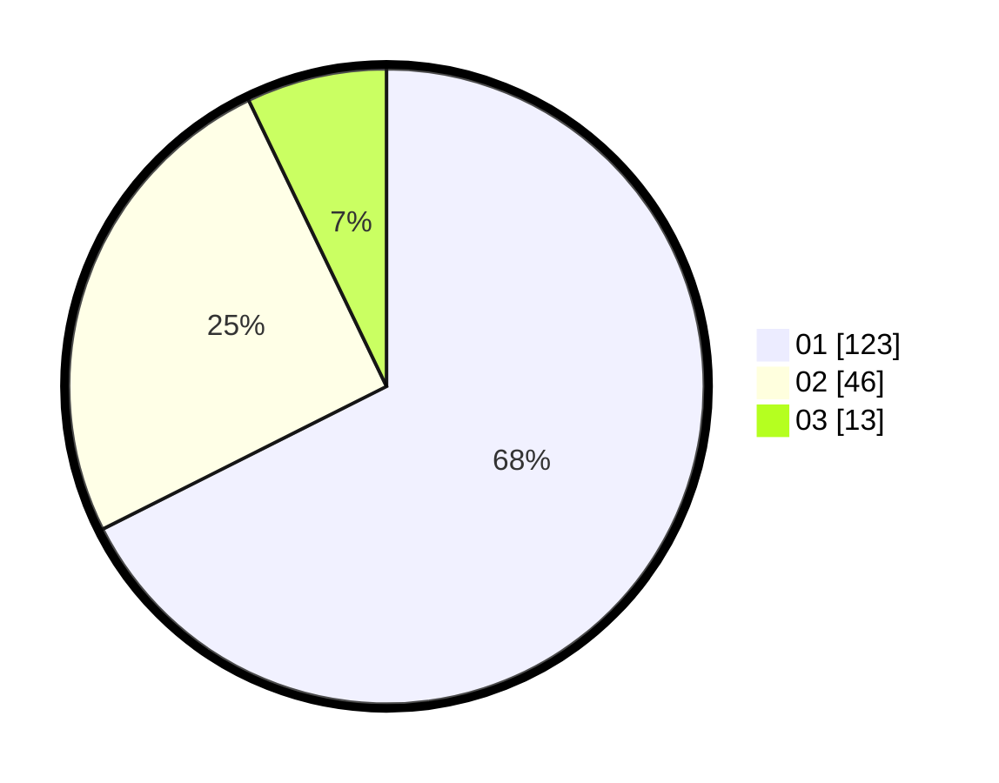

# Hasil

Hasil perolehan suara paslon dapat dilihat pada file paslon-01.txt, paslon-02.txt, dan paslon-03.txt.

Jika tidak ada, artinya data tersebut belum ada pada SIREKAP.

## Perolehan Suara

 * Paslon 01: **123**.
 * Paslon 02: **46**.
 * Paslon 03: **13**.

## Foto C Plano

https://sirekap-obj-formc.kpu.go.id/f309/pemilu/ppwp/31/74/03/10/01/3174031001050-20240214-195132--80bd7ea1-d537-4a8d-b879-d086fa5df29a.jpg

https://sirekap-obj-formc.kpu.go.id/f309/pemilu/ppwp/31/74/03/10/01/3174031001050-20240214-203318--bca528d6-9fd8-4633-81a0-0893fdb5908b.jpg

https://sirekap-obj-formc.kpu.go.id/f309/pemilu/ppwp/31/74/03/10/01/3174031001050-20240214-195811--dac9032a-af03-4322-98de-afc7d33df76a.jpg

## DATA PEMILIH TETAP

Jumlah pemilih dalam DPT: **197**.
 * L: **99**.
 * P: **98**.

## DATA PENGGUNA HAK PILIH

Jumlah pengguna hak pilih dalam DPT: **169**.
 * L: **83**.
 * P: **86**.

Jumlah pengguna hak pilih dalam DPTb: **13**.
 * L: **5**.
 * P: **8**.

Jumlah pengguna hak pilih dalam DPK: **1**.
 * L: **0**.
 * P: **1**.

Jumlah pengguna hak pilih: **183**.
 * L: **88**.
 * P: **95**.

## JUMLAH SUARA SAH DAN TIDAK SAH

JUMLAH SELURUH SUARA SAH: **182**.

JUMLAH SUARA TIDAK SAH: **2**.

JUMLAH SELURUH SUARA SAH DAN SUARA TIDAK SAH: **184**.
