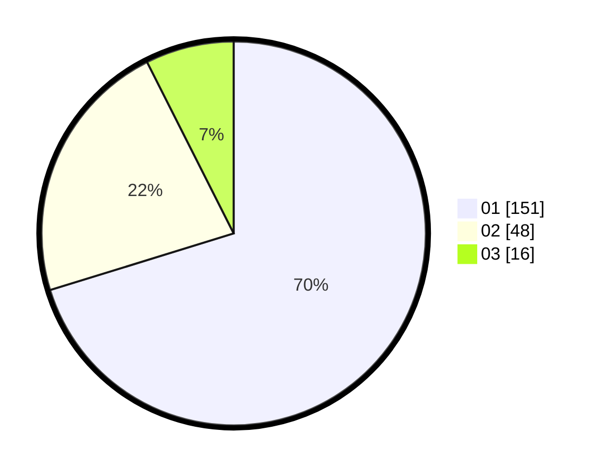

# Hasil

Hasil perolehan suara paslon dapat dilihat pada file paslon-01.txt, paslon-02.txt, dan paslon-03.txt.

Jika tidak ada, artinya data tersebut belum ada pada SIREKAP.

## Perolehan Suara

 * Paslon 01: **151**.
 * Paslon 02: **48**.
 * Paslon 03: **16**.

## Foto C Plano

https://sirekap-obj-formc.kpu.go.id/3c52/pemilu/ppwp/31/74/03/10/01/3174031001053-20240215-045806--8a38fc86-2e00-4162-a024-291a19912a1b.jpg

https://sirekap-obj-formc.kpu.go.id/3c52/pemilu/ppwp/31/74/03/10/01/3174031001053-20240215-045827--fc7feb86-9702-458f-ba31-16c9939c4f01.jpg

https://sirekap-obj-formc.kpu.go.id/3c52/pemilu/ppwp/31/74/03/10/01/3174031001053-20240215-045817--7ea62fdd-4bce-4e6a-9b23-5c69467a746b.jpg

## DATA PEMILIH TETAP

Jumlah pemilih dalam DPT: **256**.
 * L: **131**.
 * P: **125**.

## DATA PENGGUNA HAK PILIH

Jumlah pengguna hak pilih dalam DPT: **206**.
 * L: **99**.
 * P: **107**.

Jumlah pengguna hak pilih dalam DPTb: **12**.
 * L: **3**.
 * P: **9**.

Jumlah pengguna hak pilih dalam DPK: **2**.
 * L: **1**.
 * P: **1**.

Jumlah pengguna hak pilih: **220**.
 * L: **103**.
 * P: **117**.

## JUMLAH SUARA SAH DAN TIDAK SAH

JUMLAH SELURUH SUARA SAH: **215**.

JUMLAH SUARA TIDAK SAH: **5**.

JUMLAH SELURUH SUARA SAH DAN SUARA TIDAK SAH: **220**.
