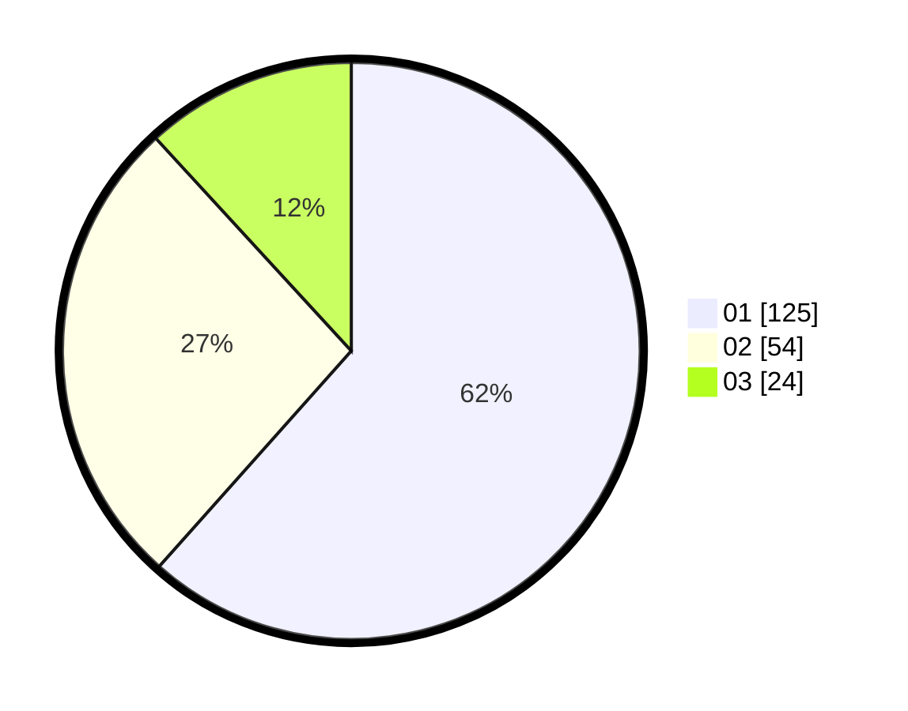

# Hasil

Hasil perolehan suara paslon dapat dilihat pada file paslon-01.txt, paslon-02.txt, dan paslon-03.txt.

Jika tidak ada, artinya data tersebut belum ada pada SIREKAP.

## Perolehan Suara

 * Paslon 01: **125**.
 * Paslon 02: **54**.
 * Paslon 03: **24**.

## Foto C Plano

https://sirekap-obj-formc.kpu.go.id/ca00/pemilu/ppwp/31/74/03/10/01/3174031001067-20240214-203404--0768d370-44f6-4430-9d80-1288e997d5c1.jpg

https://sirekap-obj-formc.kpu.go.id/ca00/pemilu/ppwp/31/74/03/10/01/3174031001067-20240214-224804--b376173c-a5ef-4427-af30-c2242fb350b4.jpg

https://sirekap-obj-formc.kpu.go.id/ca00/pemilu/ppwp/31/74/03/10/01/3174031001067-20240214-225027--564bdaa1-4e61-486a-adeb-9ec0aaa8a6f7.jpg

## DATA PEMILIH TETAP

Jumlah pemilih dalam DPT: **234**.
 * L: **122**.
 * P: **112**.

## DATA PENGGUNA HAK PILIH

Jumlah pengguna hak pilih dalam DPT: **192**.
 * L: **100**.
 * P: **92**.

Jumlah pengguna hak pilih dalam DPTb: **11**.
 * L: **3**.
 * P: **8**.

Jumlah pengguna hak pilih dalam DPK: **2**.
 * L: **1**.
 * P: **1**.

Jumlah pengguna hak pilih: **205**.
 * L: **104**.
 * P: **101**.

## JUMLAH SUARA SAH DAN TIDAK SAH

JUMLAH SELURUH SUARA SAH: **203**.

JUMLAH SUARA TIDAK SAH: **2**.

JUMLAH SELURUH SUARA SAH DAN SUARA TIDAK SAH: **205**.
