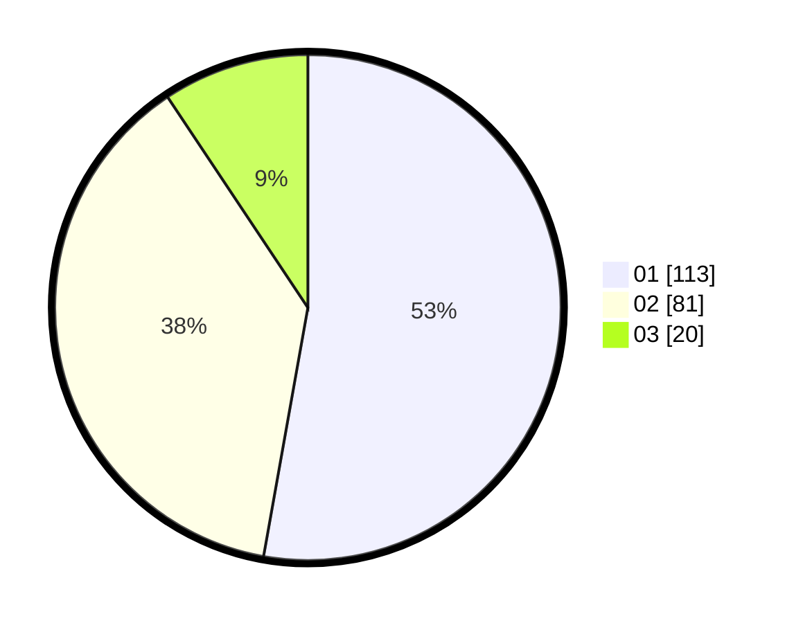

# Hasil

Hasil perolehan suara paslon dapat dilihat pada file paslon-01.txt, paslon-02.txt, dan paslon-03.txt.

Jika tidak ada, artinya data tersebut belum ada pada SIREKAP.

## Perolehan Suara

 * Paslon 01: **113**.
 * Paslon 02: **81**.
 * Paslon 03: **20**.

## Foto C Plano

https://sirekap-obj-formc.kpu.go.id/008d/pemilu/ppwp/31/74/03/10/02/3174031002004-20240217-004540--b1781ea2-6a8f-4a43-92b6-a1edda5bac55.jpg

https://sirekap-obj-formc.kpu.go.id/008d/pemilu/ppwp/31/74/03/10/02/3174031002004-20240217-004541--44ee5b50-6549-493c-9b0c-fb6981e4822a.jpg

https://sirekap-obj-formc.kpu.go.id/008d/pemilu/ppwp/31/74/03/10/02/3174031002004-20240217-004540--c3e9c0af-949a-4200-9c50-8326e75a3ec3.jpg

## DATA PEMILIH TETAP

Jumlah pemilih dalam DPT: **213**.
 * L: **104**.
 * P: **109**.

## DATA PENGGUNA HAK PILIH

Jumlah pengguna hak pilih dalam DPT: **213**.
 * L: **104**.
 * P: **109**.

Jumlah pengguna hak pilih dalam DPTb: **3**.
 * L: **2**.
 * P: **1**.

Jumlah pengguna hak pilih dalam DPK: **0**.
 * L: **0**.
 * P: **0**.

Jumlah pengguna hak pilih: **216**.
 * L: **106**.
 * P: **110**.

## JUMLAH SUARA SAH DAN TIDAK SAH

JUMLAH SELURUH SUARA SAH: **214**.

JUMLAH SUARA TIDAK SAH: **2**.

JUMLAH SELURUH SUARA SAH DAN SUARA TIDAK SAH: **216**.
