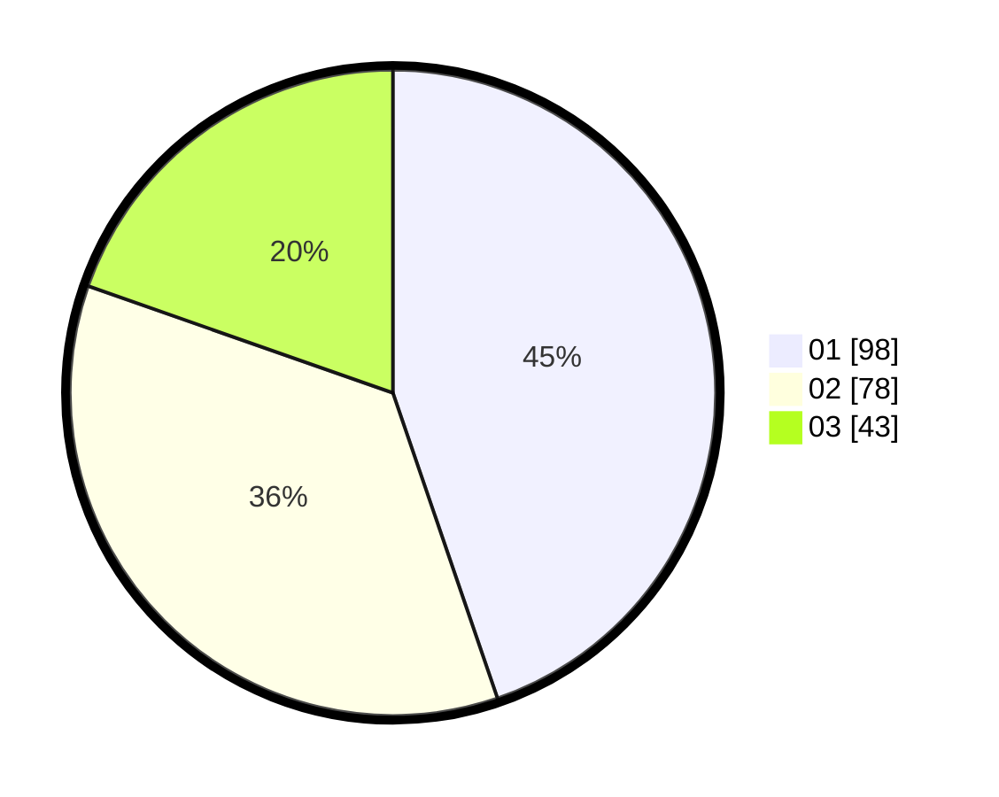

# Hasil

Hasil perolehan suara paslon dapat dilihat pada file paslon-01.txt, paslon-02.txt, dan paslon-03.txt.

Jika tidak ada, artinya data tersebut belum ada pada SIREKAP.

## Perolehan Suara

 * Paslon 01: **98**.
 * Paslon 02: **78**.
 * Paslon 03: **43**.

## Foto C Plano

https://sirekap-obj-formc.kpu.go.id/db7c/pemilu/ppwp/31/74/03/10/02/3174031002005-20240216-021011--8f8cc637-6fe8-4631-adb2-b2edf95f9871.jpg

https://sirekap-obj-formc.kpu.go.id/db7c/pemilu/ppwp/31/74/03/10/02/3174031002005-20240216-021012--985e5038-5f56-43de-8dc1-c94548e3d449.jpg

https://sirekap-obj-formc.kpu.go.id/db7c/pemilu/ppwp/31/74/03/10/02/3174031002005-20240216-021011--bd1ae850-a943-4aac-88e0-1c3c6c388c61.jpg

## DATA PEMILIH TETAP

Jumlah pemilih dalam DPT: **251**.
 * L: **121**.
 * P: **130**.

## DATA PENGGUNA HAK PILIH

Jumlah pengguna hak pilih dalam DPT: **215**.
 * L: **108**.
 * P: **107**.

Jumlah pengguna hak pilih dalam DPTb: **3**.
 * L: **1**.
 * P: **2**.

Jumlah pengguna hak pilih dalam DPK: **2**.
 * L: **2**.
 * P: **0**.

Jumlah pengguna hak pilih: **220**.
 * L: **111**.
 * P: **109**.

## JUMLAH SUARA SAH DAN TIDAK SAH

JUMLAH SELURUH SUARA SAH: **219**.

JUMLAH SUARA TIDAK SAH: **1**.

JUMLAH SELURUH SUARA SAH DAN SUARA TIDAK SAH: **220**.
