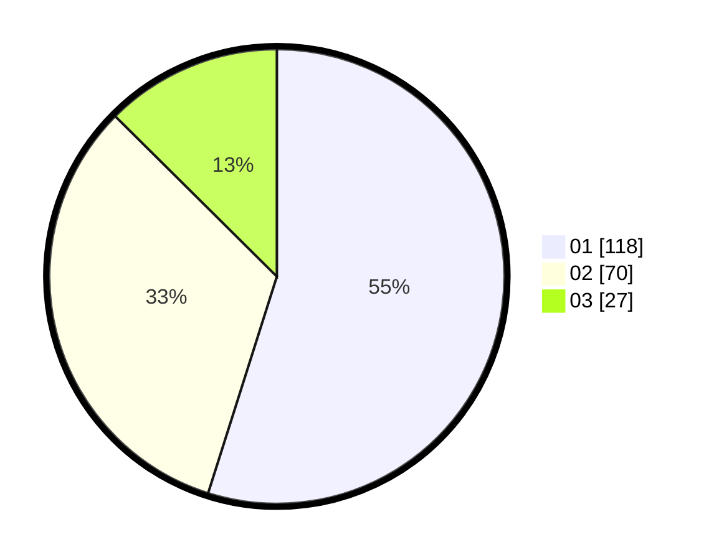

# Hasil

Hasil perolehan suara paslon dapat dilihat pada file paslon-01.txt, paslon-02.txt, dan paslon-03.txt.

Jika tidak ada, artinya data tersebut belum ada pada SIREKAP.

## Perolehan Suara

 * Paslon 01: **118**.
 * Paslon 02: **70**.
 * Paslon 03: **27**.

## Foto C Plano

https://sirekap-obj-formc.kpu.go.id/178d/pemilu/ppwp/31/74/03/10/02/3174031002006-20240217-101556--e12fb5d2-c6e1-4d69-a839-cd5cb6455036.jpg

https://sirekap-obj-formc.kpu.go.id/178d/pemilu/ppwp/31/74/03/10/02/3174031002006-20240217-102400--6d9b0d59-756e-472e-aa1f-456bf9885ced.jpg

https://sirekap-obj-formc.kpu.go.id/178d/pemilu/ppwp/31/74/03/10/02/3174031002006-20240217-101848--42fef98f-d6fd-4e83-aa18-7cf9657cf49d.jpg

## DATA PEMILIH TETAP

Jumlah pemilih dalam DPT: **261**.
 * L: **135**.
 * P: **126**.

## DATA PENGGUNA HAK PILIH

Jumlah pengguna hak pilih dalam DPT: **219**.
 * L: **110**.
 * P: **109**.

Jumlah pengguna hak pilih dalam DPTb: **2**.
 * L: **1**.
 * P: **1**.

Jumlah pengguna hak pilih dalam DPK: **0**.
 * L: **0**.
 * P: **0**.

Jumlah pengguna hak pilih: **221**.
 * L: **111**.
 * P: **110**.

## JUMLAH SUARA SAH DAN TIDAK SAH

JUMLAH SELURUH SUARA SAH: **215**.

JUMLAH SUARA TIDAK SAH: **6**.

JUMLAH SELURUH SUARA SAH DAN SUARA TIDAK SAH: **221**.
