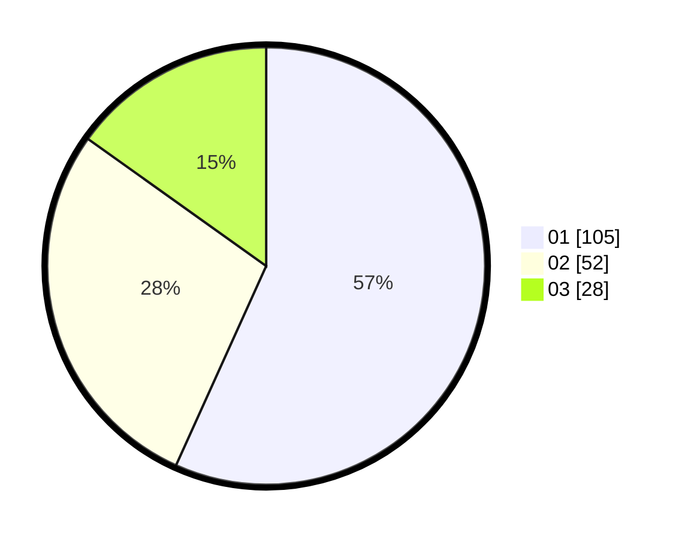

# Hasil

Hasil perolehan suara paslon dapat dilihat pada file paslon-01.txt, paslon-02.txt, dan paslon-03.txt.

Jika tidak ada, artinya data tersebut belum ada pada SIREKAP.

## Perolehan Suara

 * Paslon 01: **105**.
 * Paslon 02: **52**.
 * Paslon 03: **28**.

## Foto C Plano

https://sirekap-obj-formc.kpu.go.id/ca0c/pemilu/ppwp/31/74/03/10/02/3174031002007-20240217-005255--c76f4700-e659-4785-951c-0a4f6443a0f9.jpg

https://sirekap-obj-formc.kpu.go.id/ca0c/pemilu/ppwp/31/74/03/10/02/3174031002007-20240217-005257--f7454d69-b460-4261-9376-29ea5608357a.jpg

https://sirekap-obj-formc.kpu.go.id/ca0c/pemilu/ppwp/31/74/03/10/02/3174031002007-20240217-005256--32f5bb46-3485-4c6b-9d55-7b8d290fa4da.jpg

## DATA PEMILIH TETAP

Jumlah pemilih dalam DPT: **203**.
 * L: **107**.
 * P: **96**.

## DATA PENGGUNA HAK PILIH

Jumlah pengguna hak pilih dalam DPT: **176**.
 * L: **91**.
 * P: **85**.

Jumlah pengguna hak pilih dalam DPTb: **4**.
 * L: **0**.
 * P: **4**.

Jumlah pengguna hak pilih dalam DPK: **5**.
 * L: **1**.
 * P: **4**.

Jumlah pengguna hak pilih: **185**.
 * L: **92**.
 * P: **93**.

## JUMLAH SUARA SAH DAN TIDAK SAH

JUMLAH SELURUH SUARA SAH: **185**.

JUMLAH SUARA TIDAK SAH: **0**.

JUMLAH SELURUH SUARA SAH DAN SUARA TIDAK SAH: **185**.
