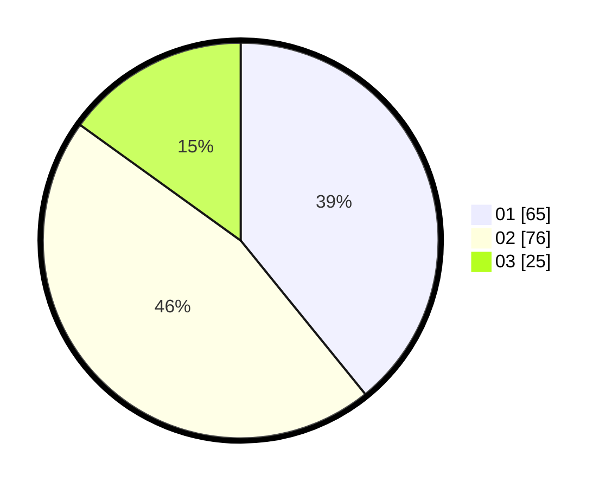

# Hasil

Hasil perolehan suara paslon dapat dilihat pada file paslon-01.txt, paslon-02.txt, dan paslon-03.txt.

Jika tidak ada, artinya data tersebut belum ada pada SIREKAP.

## Perolehan Suara

 * Paslon 01: **65**.
 * Paslon 02: **76**.
 * Paslon 03: **25**.

## Foto C Plano

https://sirekap-obj-formc.kpu.go.id/573f/pemilu/ppwp/31/74/03/10/02/3174031002008-20240215-232341--b2f20680-59f5-461c-aa03-399000f5836b.jpg

https://sirekap-obj-formc.kpu.go.id/573f/pemilu/ppwp/31/74/03/10/02/3174031002008-20240215-232344--4c813acd-63be-4985-99bb-7ac5c83f5385.jpg

https://sirekap-obj-formc.kpu.go.id/573f/pemilu/ppwp/31/74/03/10/02/3174031002008-20240215-232343--1ce730ad-a770-4ed4-a89a-f0abed107d29.jpg

## DATA PEMILIH TETAP

Jumlah pemilih dalam DPT: **213**.
 * L: **110**.
 * P: **103**.

## DATA PENGGUNA HAK PILIH

Jumlah pengguna hak pilih dalam DPT: **151**.
 * L: **75**.
 * P: **76**.

Jumlah pengguna hak pilih dalam DPTb: **13**.
 * L: **5**.
 * P: **8**.

Jumlah pengguna hak pilih dalam DPK: **2**.
 * L: **1**.
 * P: **1**.

Jumlah pengguna hak pilih: **166**.
 * L: **81**.
 * P: **85**.

## JUMLAH SUARA SAH DAN TIDAK SAH

JUMLAH SELURUH SUARA SAH: **166**.

JUMLAH SUARA TIDAK SAH: **0**.

JUMLAH SELURUH SUARA SAH DAN SUARA TIDAK SAH: **166**.
