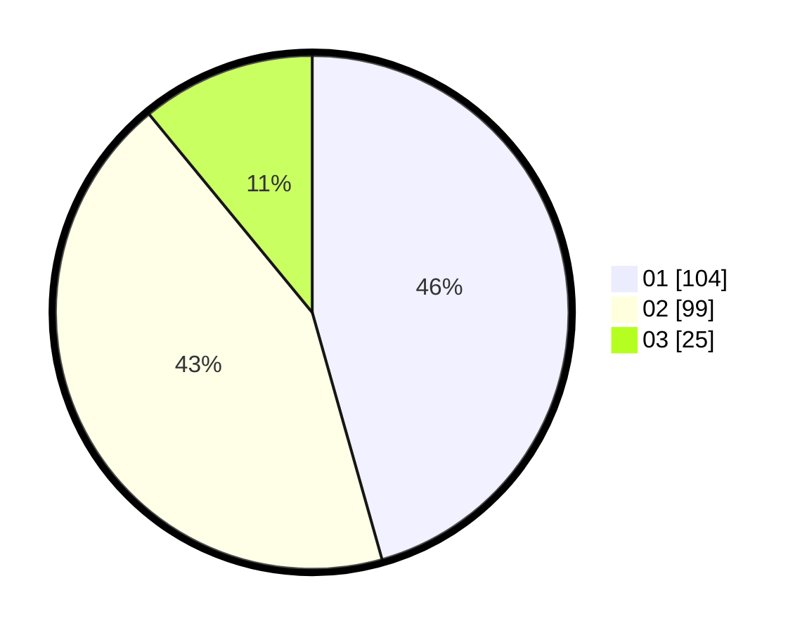

# Hasil

Hasil perolehan suara paslon dapat dilihat pada file paslon-01.txt, paslon-02.txt, dan paslon-03.txt.

Jika tidak ada, artinya data tersebut belum ada pada SIREKAP.

## Perolehan Suara

 * Paslon 01: **104**.
 * Paslon 02: **99**.
 * Paslon 03: **25**.

## Foto C Plano

https://sirekap-obj-formc.kpu.go.id/a7e6/pemilu/ppwp/31/74/03/10/02/3174031002011-20240216-114900--5e10af41-01ef-49eb-b702-5ea9d7879a35.jpg

https://sirekap-obj-formc.kpu.go.id/a7e6/pemilu/ppwp/31/74/03/10/02/3174031002011-20240216-015936--109bcb9c-3387-4676-ada2-e86068e3ea4b.jpg

https://sirekap-obj-formc.kpu.go.id/a7e6/pemilu/ppwp/31/74/03/10/02/3174031002011-20240216-015934--63519962-6b31-4b40-84e1-d3126cc9c4fb.jpg

## DATA PEMILIH TETAP

Jumlah pemilih dalam DPT: **283**.
 * L: **131**.
 * P: **152**.

## DATA PENGGUNA HAK PILIH

Jumlah pengguna hak pilih dalam DPT: **226**.
 * L: **106**.
 * P: **120**.

Jumlah pengguna hak pilih dalam DPTb: **4**.
 * L: **2**.
 * P: **2**.

Jumlah pengguna hak pilih dalam DPK: **1**.
 * L: **0**.
 * P: **1**.

Jumlah pengguna hak pilih: **231**.
 * L: **108**.
 * P: **123**.

## JUMLAH SUARA SAH DAN TIDAK SAH

JUMLAH SELURUH SUARA SAH: **228**.

JUMLAH SUARA TIDAK SAH: **3**.

JUMLAH SELURUH SUARA SAH DAN SUARA TIDAK SAH: **231**.
