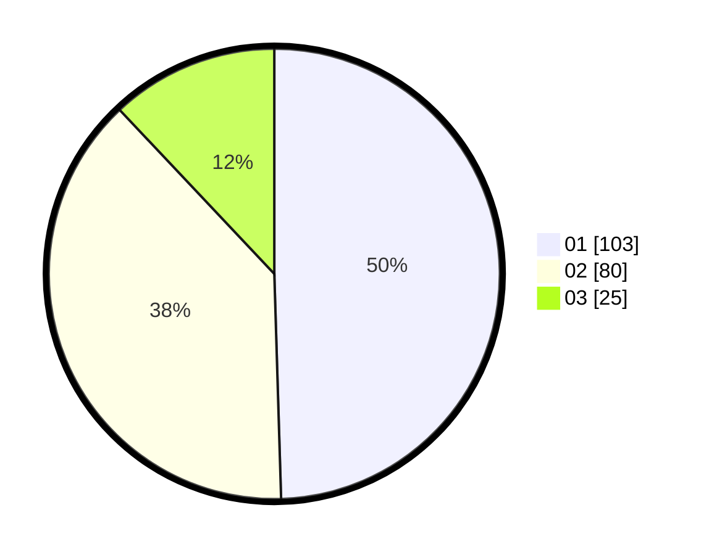

# Hasil

Hasil perolehan suara paslon dapat dilihat pada file paslon-01.txt, paslon-02.txt, dan paslon-03.txt.

Jika tidak ada, artinya data tersebut belum ada pada SIREKAP.

## Perolehan Suara

 * Paslon 01: **103**.
 * Paslon 02: **80**.
 * Paslon 03: **25**.

## Foto C Plano

https://sirekap-obj-formc.kpu.go.id/805a/pemilu/ppwp/31/74/03/10/02/3174031002014-20240216-060209--afe98502-08d5-4c1d-8197-b45e7c72468f.jpg

https://sirekap-obj-formc.kpu.go.id/805a/pemilu/ppwp/31/74/03/10/02/3174031002014-20240216-060216--1cf50a3f-56e2-4d74-bc10-77c96881c749.jpg

https://sirekap-obj-formc.kpu.go.id/805a/pemilu/ppwp/31/74/03/10/02/3174031002014-20240216-060213--a375f662-029b-44dd-bf48-d0dabfb04130.jpg

## DATA PEMILIH TETAP

Jumlah pemilih dalam DPT: **231**.
 * L: **113**.
 * P: **118**.

## DATA PENGGUNA HAK PILIH

Jumlah pengguna hak pilih dalam DPT: **201**.
 * L: **98**.
 * P: **103**.

Jumlah pengguna hak pilih dalam DPTb: **6**.
 * L: **1**.
 * P: **5**.

Jumlah pengguna hak pilih dalam DPK: **4**.
 * L: **2**.
 * P: **2**.

Jumlah pengguna hak pilih: **211**.
 * L: **101**.
 * P: **110**.

## JUMLAH SUARA SAH DAN TIDAK SAH

JUMLAH SELURUH SUARA SAH: **208**.

JUMLAH SUARA TIDAK SAH: **3**.

JUMLAH SELURUH SUARA SAH DAN SUARA TIDAK SAH: **211**.
