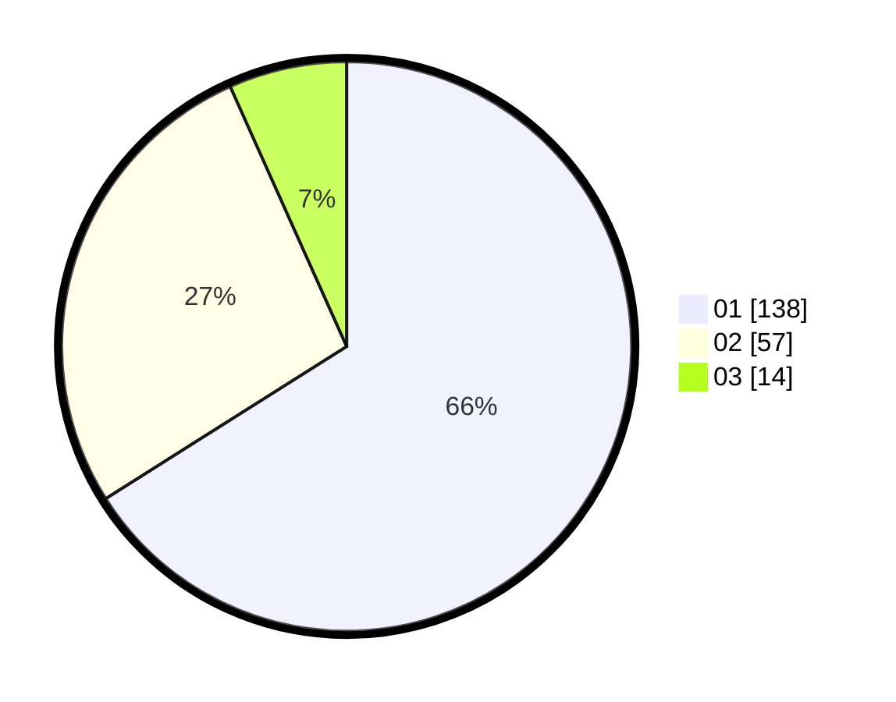

# Hasil

Hasil perolehan suara paslon dapat dilihat pada file paslon-01.txt, paslon-02.txt, dan paslon-03.txt.

Jika tidak ada, artinya data tersebut belum ada pada SIREKAP.

## Perolehan Suara

 * Paslon 01: **138**.
 * Paslon 02: **57**.
 * Paslon 03: **14**.

## Foto C Plano

https://sirekap-obj-formc.kpu.go.id/ea86/pemilu/ppwp/31/74/03/10/02/3174031002020-20240215-235653--0ea84bf3-f495-438f-a416-2f029b142b59.jpg

https://sirekap-obj-formc.kpu.go.id/ea86/pemilu/ppwp/31/74/03/10/02/3174031002020-20240215-235656--c414f100-fcb7-4846-a254-24a92e430702.jpg

https://sirekap-obj-formc.kpu.go.id/ea86/pemilu/ppwp/31/74/03/10/02/3174031002020-20240215-235654--4e09422b-0d75-4821-a53b-8b7d916166b8.jpg

## DATA PEMILIH TETAP

Jumlah pemilih dalam DPT: **250**.
 * L: **134**.
 * P: **116**.

## DATA PENGGUNA HAK PILIH

Jumlah pengguna hak pilih dalam DPT: **202**.
 * L: **106**.
 * P: **96**.

Jumlah pengguna hak pilih dalam DPTb: **9**.
 * L: **3**.
 * P: **6**.

Jumlah pengguna hak pilih dalam DPK: **0**.
 * L: **0**.
 * P: **0**.

Jumlah pengguna hak pilih: **211**.
 * L: **109**.
 * P: **102**.

## JUMLAH SUARA SAH DAN TIDAK SAH

JUMLAH SELURUH SUARA SAH: **209**.

JUMLAH SUARA TIDAK SAH: **2**.

JUMLAH SELURUH SUARA SAH DAN SUARA TIDAK SAH: **211**.
