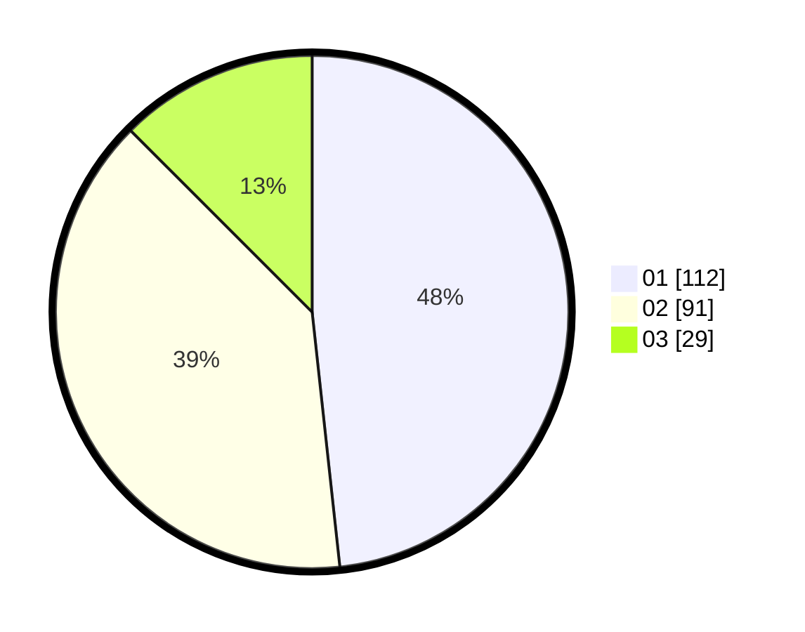

# Hasil

Hasil perolehan suara paslon dapat dilihat pada file paslon-01.txt, paslon-02.txt, dan paslon-03.txt.

Jika tidak ada, artinya data tersebut belum ada pada SIREKAP.

## Perolehan Suara

 * Paslon 01: **112**.
 * Paslon 02: **91**.
 * Paslon 03: **29**.

## Foto C Plano

https://sirekap-obj-formc.kpu.go.id/0786/pemilu/ppwp/31/74/03/10/02/3174031002021-20240216-001657--542c200b-7fd3-40c9-8dad-b36959af0127.jpg

https://sirekap-obj-formc.kpu.go.id/0786/pemilu/ppwp/31/74/03/10/02/3174031002021-20240216-001659--d5d36da2-bbe5-4d21-9190-e37553ce4ca9.jpg

https://sirekap-obj-formc.kpu.go.id/0786/pemilu/ppwp/31/74/03/10/02/3174031002021-20240216-001658--63d06dc7-1b19-4180-a9d3-704ed4ba84af.jpg

## DATA PEMILIH TETAP

Jumlah pemilih dalam DPT: **0**.
 * L: **0**.
 * P: **0**.

## DATA PENGGUNA HAK PILIH

Jumlah pengguna hak pilih dalam DPT: **0**.
 * L: **0**.
 * P: **0**.

Jumlah pengguna hak pilih dalam DPTb: **0**.
 * L: **0**.
 * P: **0**.

Jumlah pengguna hak pilih dalam DPK: **0**.
 * L: **0**.
 * P: **0**.

Jumlah pengguna hak pilih: **0**.
 * L: **0**.
 * P: **0**.

## JUMLAH SUARA SAH DAN TIDAK SAH

JUMLAH SELURUH SUARA SAH: **232**.

JUMLAH SUARA TIDAK SAH: **1**.

JUMLAH SELURUH SUARA SAH DAN SUARA TIDAK SAH: **233**.
