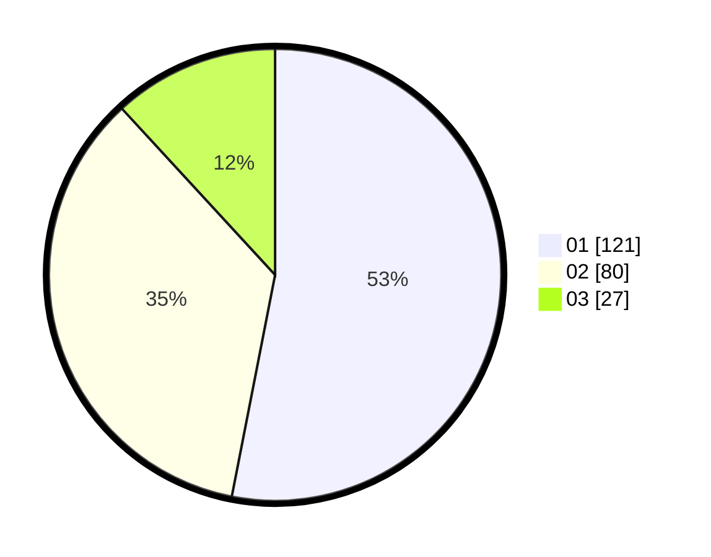

# Hasil

Hasil perolehan suara paslon dapat dilihat pada file paslon-01.txt, paslon-02.txt, dan paslon-03.txt.

Jika tidak ada, artinya data tersebut belum ada pada SIREKAP.

## Perolehan Suara

 * Paslon 01: **121**.
 * Paslon 02: **80**.
 * Paslon 03: **27**.

## Foto C Plano

https://sirekap-obj-formc.kpu.go.id/e7ac/pemilu/ppwp/31/74/03/10/02/3174031002025-20240217-003022--5fddff9c-f2d8-4951-92e8-fe7dbe2a05d6.jpg

https://sirekap-obj-formc.kpu.go.id/e7ac/pemilu/ppwp/31/74/03/10/02/3174031002025-20240217-003024--f590b2ce-5da8-46f1-a2fd-7ea2458ad917.jpg

https://sirekap-obj-formc.kpu.go.id/e7ac/pemilu/ppwp/31/74/03/10/02/3174031002025-20240217-003023--58a6efdb-0f4c-4b0d-bf77-a5c3d26ad0ef.jpg

## DATA PEMILIH TETAP

Jumlah pemilih dalam DPT: **283**.
 * L: **145**.
 * P: **138**.

## DATA PENGGUNA HAK PILIH

Jumlah pengguna hak pilih dalam DPT: **230**.
 * L: **115**.
 * P: **115**.

Jumlah pengguna hak pilih dalam DPTb: **1**.
 * L: **0**.
 * P: **1**.

Jumlah pengguna hak pilih dalam DPK: **0**.
 * L: **0**.
 * P: **0**.

Jumlah pengguna hak pilih: **231**.
 * L: **115**.
 * P: **116**.

## JUMLAH SUARA SAH DAN TIDAK SAH

JUMLAH SELURUH SUARA SAH: **228**.

JUMLAH SUARA TIDAK SAH: **3**.

JUMLAH SELURUH SUARA SAH DAN SUARA TIDAK SAH: **231**.
