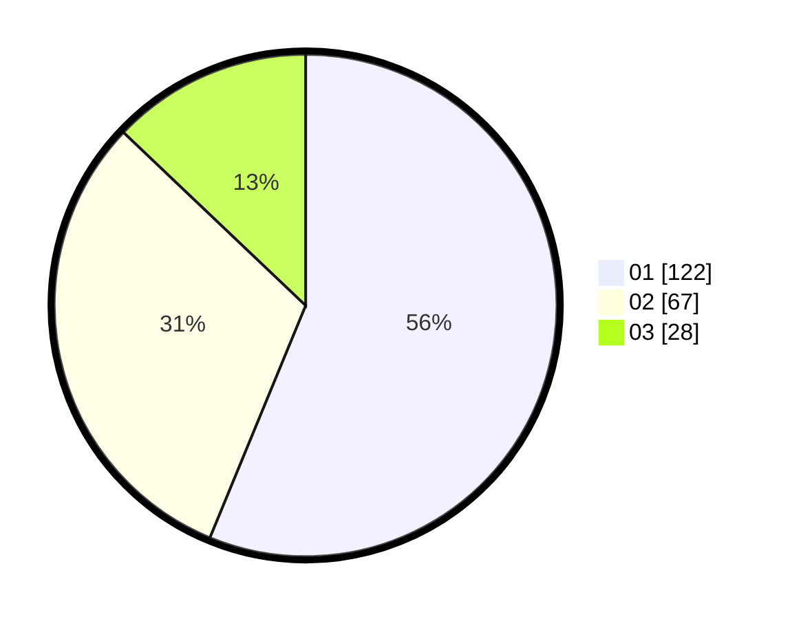

# Hasil

Hasil perolehan suara paslon dapat dilihat pada file paslon-01.txt, paslon-02.txt, dan paslon-03.txt.

Jika tidak ada, artinya data tersebut belum ada pada SIREKAP.

## Perolehan Suara

 * Paslon 01: **122**.
 * Paslon 02: **67**.
 * Paslon 03: **28**.

## Foto C Plano

https://sirekap-obj-formc.kpu.go.id/4b9f/pemilu/ppwp/31/74/03/10/02/3174031002028-20240216-115513--1c8311be-b611-4432-922c-071e65c4c40a.jpg

https://sirekap-obj-formc.kpu.go.id/4b9f/pemilu/ppwp/31/74/03/10/02/3174031002028-20240216-115514--0f94f787-eb30-4d3e-aa16-ab300076c7f5.jpg

https://sirekap-obj-formc.kpu.go.id/4b9f/pemilu/ppwp/31/74/03/10/02/3174031002028-20240216-115513--a73ab83b-5b57-46e7-8e1e-60d0e345e4fe.jpg

## DATA PEMILIH TETAP

Jumlah pemilih dalam DPT: **0**.
 * L: **0**.
 * P: **0**.

## DATA PENGGUNA HAK PILIH

Jumlah pengguna hak pilih dalam DPT: **0**.
 * L: **0**.
 * P: **0**.

Jumlah pengguna hak pilih dalam DPTb: **0**.
 * L: **0**.
 * P: **0**.

Jumlah pengguna hak pilih dalam DPK: **0**.
 * L: **0**.
 * P: **0**.

Jumlah pengguna hak pilih: **0**.
 * L: **0**.
 * P: **0**.

## JUMLAH SUARA SAH DAN TIDAK SAH

JUMLAH SELURUH SUARA SAH: **217**.

JUMLAH SUARA TIDAK SAH: **9**.

JUMLAH SELURUH SUARA SAH DAN SUARA TIDAK SAH: **226**.
