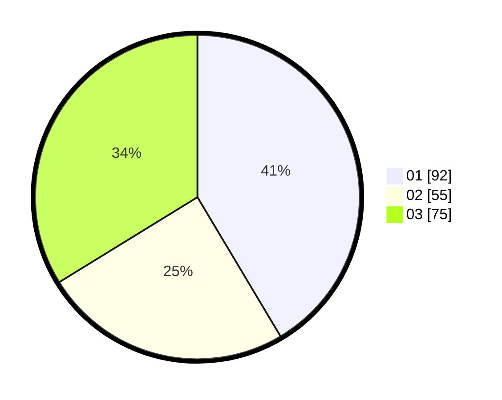

# Hasil

Hasil perolehan suara paslon dapat dilihat pada file paslon-01.txt, paslon-02.txt, dan paslon-03.txt.

Jika tidak ada, artinya data tersebut belum ada pada SIREKAP.

## Perolehan Suara

 * Paslon 01: **92**.
 * Paslon 02: **55**.
 * Paslon 03: **75**.

## Foto C Plano

https://sirekap-obj-formc.kpu.go.id/820d/pemilu/ppwp/31/74/03/10/02/3174031002031-20240215-202852--0fd06e6a-229b-4ff7-9654-b9d3c6c869b4.jpg

https://sirekap-obj-formc.kpu.go.id/820d/pemilu/ppwp/31/74/03/10/02/3174031002031-20240215-202910--c0971ef2-6106-4d8c-ba94-f20184b905d7.jpg

https://sirekap-obj-formc.kpu.go.id/820d/pemilu/ppwp/31/74/03/10/02/3174031002031-20240216-010104--21734da5-3bdb-4ae9-875b-08b5cdb04f71.jpg

## DATA PEMILIH TETAP

Jumlah pemilih dalam DPT: **296**.
 * L: **145**.
 * P: **151**.

## DATA PENGGUNA HAK PILIH

Jumlah pengguna hak pilih dalam DPT: **217**.
 * L: **106**.
 * P: **111**.

Jumlah pengguna hak pilih dalam DPTb: **5**.
 * L: **2**.
 * P: **3**.

Jumlah pengguna hak pilih dalam DPK: **4**.
 * L: **0**.
 * P: **4**.

Jumlah pengguna hak pilih: **226**.
 * L: **108**.
 * P: **118**.

## JUMLAH SUARA SAH DAN TIDAK SAH

JUMLAH SELURUH SUARA SAH: **222**.

JUMLAH SUARA TIDAK SAH: **4**.

JUMLAH SELURUH SUARA SAH DAN SUARA TIDAK SAH: **226**.
