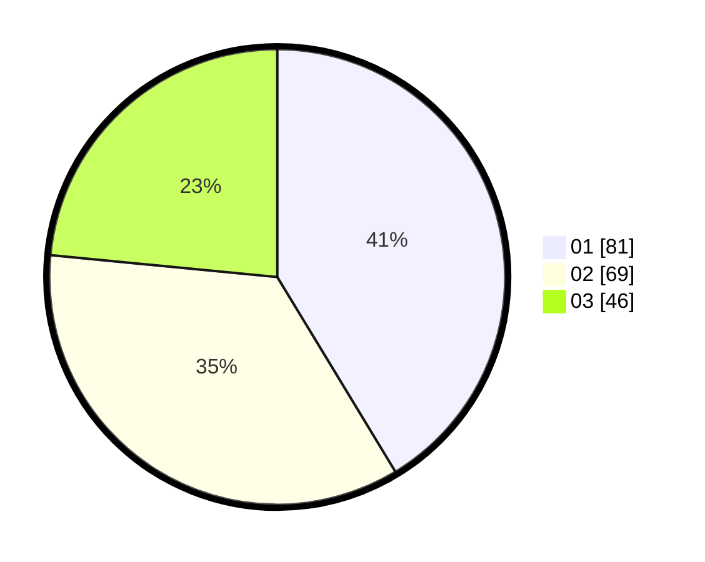

# Hasil

Hasil perolehan suara paslon dapat dilihat pada file paslon-01.txt, paslon-02.txt, dan paslon-03.txt.

Jika tidak ada, artinya data tersebut belum ada pada SIREKAP.

## Perolehan Suara

 * Paslon 01: **81**.
 * Paslon 02: **69**.
 * Paslon 03: **46**.

## Foto C Plano

https://sirekap-obj-formc.kpu.go.id/b5a2/pemilu/ppwp/31/74/03/10/02/3174031002032-20240215-023542--bde2fa8a-cf4c-45a9-b86a-fb8a7e65bb3d.jpg

https://sirekap-obj-formc.kpu.go.id/b5a2/pemilu/ppwp/31/74/03/10/02/3174031002032-20240215-023604--b59b09f8-8d2f-4e9b-afe8-a22cf46380f8.jpg

https://sirekap-obj-formc.kpu.go.id/b5a2/pemilu/ppwp/31/74/03/10/02/3174031002032-20240215-023553--1a158adf-4117-4be3-b58a-c7336dd731f8.jpg

## DATA PEMILIH TETAP

Jumlah pemilih dalam DPT: **247**.
 * L: **110**.
 * P: **137**.

## DATA PENGGUNA HAK PILIH

Jumlah pengguna hak pilih dalam DPT: **193**.
 * L: **83**.
 * P: **110**.

Jumlah pengguna hak pilih dalam DPTb: **1**.
 * L: **0**.
 * P: **1**.

Jumlah pengguna hak pilih dalam DPK: **5**.
 * L: **2**.
 * P: **3**.

Jumlah pengguna hak pilih: **199**.
 * L: **85**.
 * P: **114**.

## JUMLAH SUARA SAH DAN TIDAK SAH

JUMLAH SELURUH SUARA SAH: **196**.

JUMLAH SUARA TIDAK SAH: **3**.

JUMLAH SELURUH SUARA SAH DAN SUARA TIDAK SAH: **199**.
