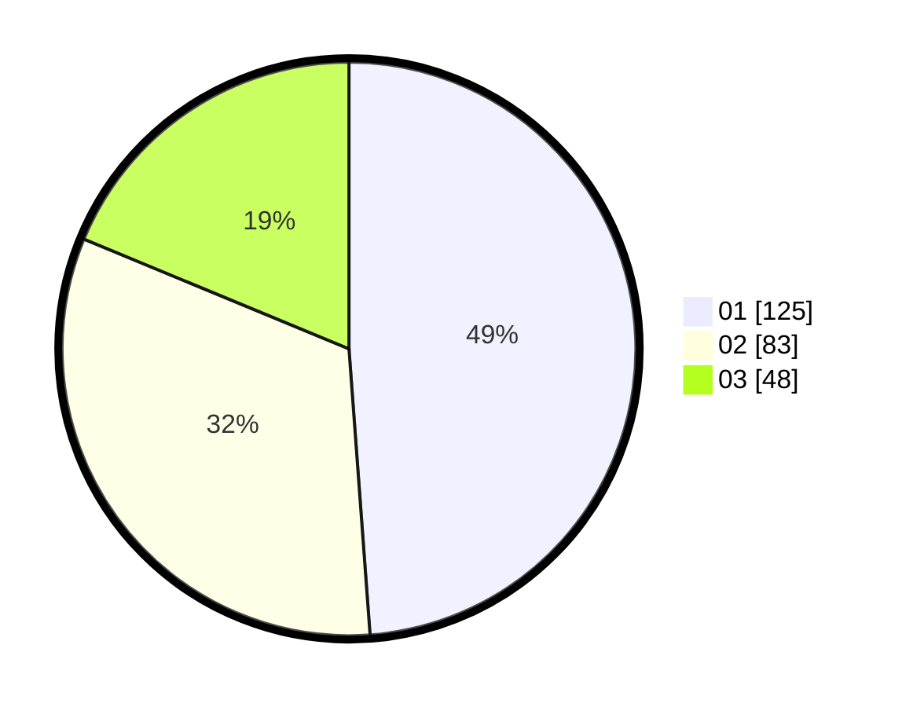

# Hasil

Hasil perolehan suara paslon dapat dilihat pada file paslon-01.txt, paslon-02.txt, dan paslon-03.txt.

Jika tidak ada, artinya data tersebut belum ada pada SIREKAP.

## Perolehan Suara

 * Paslon 01: **125**.
 * Paslon 02: **83**.
 * Paslon 03: **48**.

## Foto C Plano

https://sirekap-obj-formc.kpu.go.id/8d05/pemilu/ppwp/31/74/03/10/02/3174031002041-20240216-011557--8d7b670f-b754-42f3-8a32-0c64bd7ab880.jpg

https://sirekap-obj-formc.kpu.go.id/8d05/pemilu/ppwp/31/74/03/10/02/3174031002041-20240216-011608--3b1147fa-354e-4672-a783-97ac5cdbfbdb.jpg

https://sirekap-obj-formc.kpu.go.id/8d05/pemilu/ppwp/31/74/03/10/02/3174031002041-20240216-011600--4fc32079-1e36-446f-a201-614cf829f16d.jpg

## DATA PEMILIH TETAP

Jumlah pemilih dalam DPT: **296**.
 * L: **153**.
 * P: **143**.

## DATA PENGGUNA HAK PILIH

Jumlah pengguna hak pilih dalam DPT: **254**.
 * L: **130**.
 * P: **124**.

Jumlah pengguna hak pilih dalam DPTb: **4**.
 * L: **2**.
 * P: **2**.

Jumlah pengguna hak pilih dalam DPK: **3**.
 * L: **1**.
 * P: **2**.

Jumlah pengguna hak pilih: **261**.
 * L: **133**.
 * P: **128**.

## JUMLAH SUARA SAH DAN TIDAK SAH

JUMLAH SELURUH SUARA SAH: **256**.

JUMLAH SUARA TIDAK SAH: **5**.

JUMLAH SELURUH SUARA SAH DAN SUARA TIDAK SAH: **261**.
