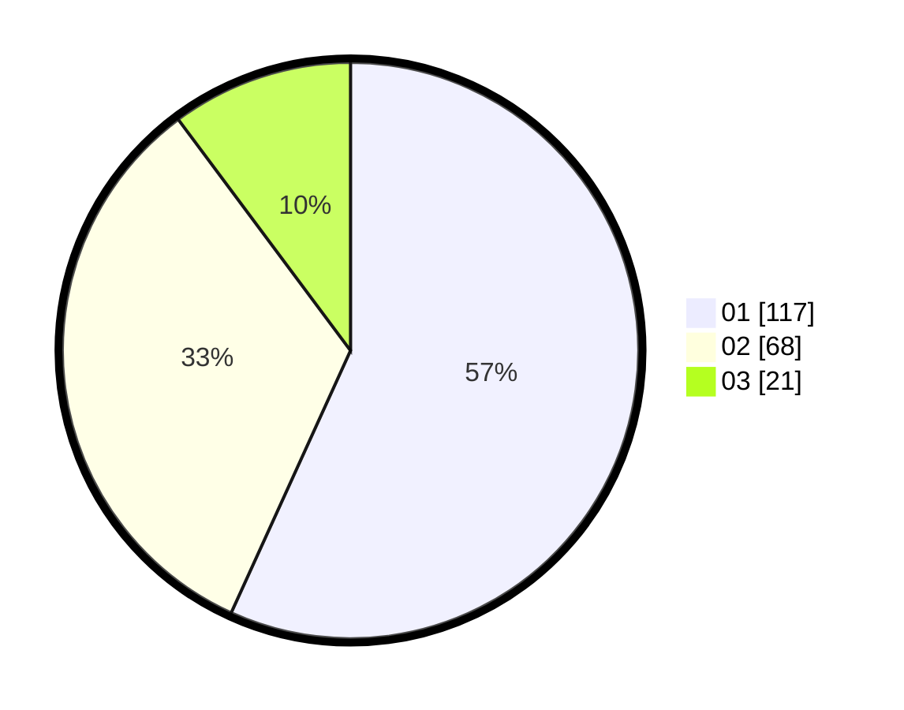

# Hasil

Hasil perolehan suara paslon dapat dilihat pada file paslon-01.txt, paslon-02.txt, dan paslon-03.txt.

Jika tidak ada, artinya data tersebut belum ada pada SIREKAP.

## Perolehan Suara

 * Paslon 01: **117**.
 * Paslon 02: **68**.
 * Paslon 03: **21**.

## Foto C Plano

https://sirekap-obj-formc.kpu.go.id/4466/pemilu/ppwp/31/74/03/10/02/3174031002050-20240214-212607--e1dd5529-9406-4cc6-a741-900688251ba0.jpg

https://sirekap-obj-formc.kpu.go.id/4466/pemilu/ppwp/31/74/03/10/02/3174031002050-20240214-212629--069a9442-646a-4e51-b349-8e0f71445b6a.jpg

https://sirekap-obj-formc.kpu.go.id/4466/pemilu/ppwp/31/74/03/10/02/3174031002050-20240214-212618--3e6453e9-9921-4e19-9d2a-b6c53ab0aa7f.jpg

## DATA PEMILIH TETAP

Jumlah pemilih dalam DPT: **250**.
 * L: **126**.
 * P: **124**.

## DATA PENGGUNA HAK PILIH

Jumlah pengguna hak pilih dalam DPT: **206**.
 * L: **106**.
 * P: **100**.

Jumlah pengguna hak pilih dalam DPTb: **5**.
 * L: **2**.
 * P: **3**.

Jumlah pengguna hak pilih dalam DPK: **1**.
 * L: **0**.
 * P: **1**.

Jumlah pengguna hak pilih: **212**.
 * L: **108**.
 * P: **104**.

## JUMLAH SUARA SAH DAN TIDAK SAH

JUMLAH SELURUH SUARA SAH: **206**.

JUMLAH SUARA TIDAK SAH: **6**.

JUMLAH SELURUH SUARA SAH DAN SUARA TIDAK SAH: **212**.
