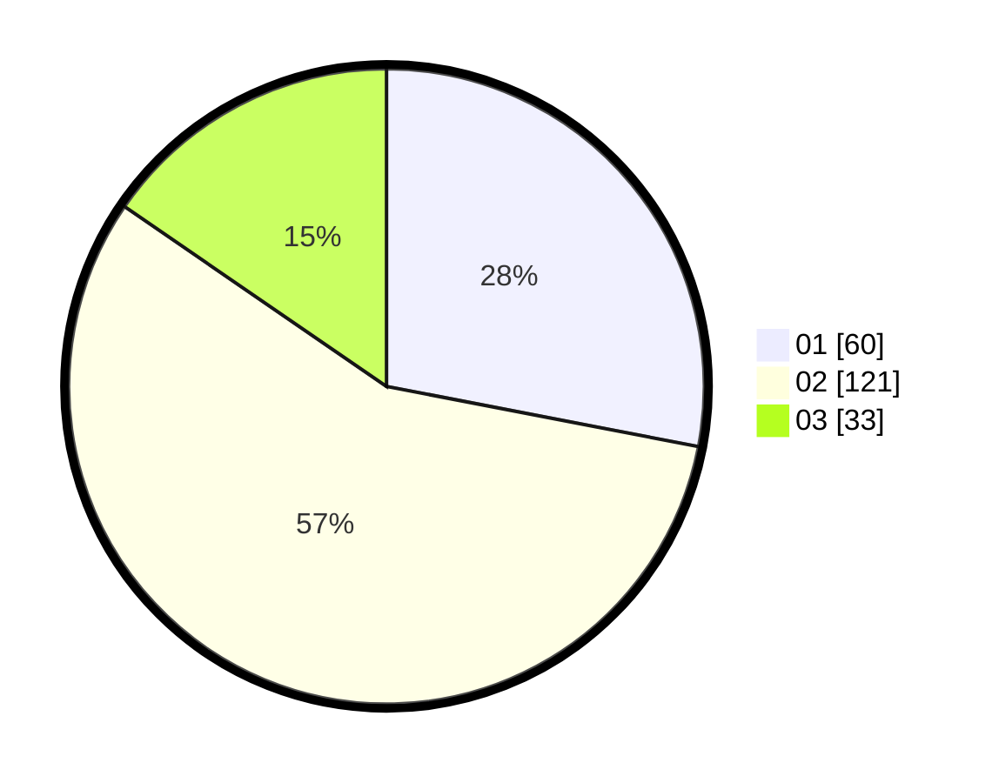

# Hasil

Hasil perolehan suara paslon dapat dilihat pada file paslon-01.txt, paslon-02.txt, dan paslon-03.txt.

Jika tidak ada, artinya data tersebut belum ada pada SIREKAP.

## Perolehan Suara

 * Paslon 01: **60**.
 * Paslon 02: **121**.
 * Paslon 03: **33**.

## Foto C Plano

https://sirekap-obj-formc.kpu.go.id/7a3c/pemilu/ppwp/31/74/03/10/02/3174031002056-20240215-205615--141c7d11-0ebd-4434-a359-a252fd900b60.jpg

https://sirekap-obj-formc.kpu.go.id/7a3c/pemilu/ppwp/31/74/03/10/02/3174031002056-20240215-205616--1ae0be3f-d0ef-462e-8df9-863284334e02.jpg

https://sirekap-obj-formc.kpu.go.id/7a3c/pemilu/ppwp/31/74/03/10/02/3174031002056-20240215-205615--a806db94-9b13-435f-89c1-f28fa8c548e7.jpg

## DATA PEMILIH TETAP

Jumlah pemilih dalam DPT: **278**.
 * L: **154**.
 * P: **124**.

## DATA PENGGUNA HAK PILIH

Jumlah pengguna hak pilih dalam DPT: **216**.
 * L: **112**.
 * P: **104**.

Jumlah pengguna hak pilih dalam DPTb: **0**.
 * L: **0**.
 * P: **0**.

Jumlah pengguna hak pilih dalam DPK: **1**.
 * L: **0**.
 * P: **1**.

Jumlah pengguna hak pilih: **217**.
 * L: **112**.
 * P: **105**.

## JUMLAH SUARA SAH DAN TIDAK SAH

JUMLAH SELURUH SUARA SAH: **214**.

JUMLAH SUARA TIDAK SAH: **3**.

JUMLAH SELURUH SUARA SAH DAN SUARA TIDAK SAH: **217**.
