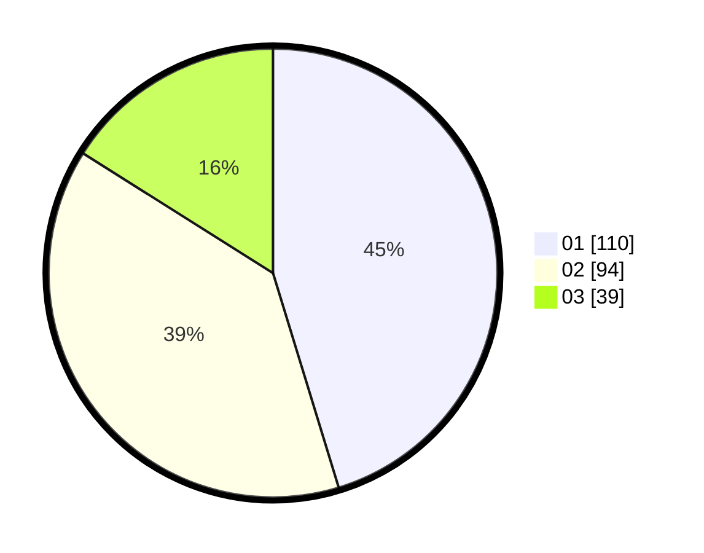

# Hasil

Hasil perolehan suara paslon dapat dilihat pada file paslon-01.txt, paslon-02.txt, dan paslon-03.txt.

Jika tidak ada, artinya data tersebut belum ada pada SIREKAP.

## Perolehan Suara

 * Paslon 01: **110**.
 * Paslon 02: **94**.
 * Paslon 03: **39**.

## Foto C Plano

https://sirekap-obj-formc.kpu.go.id/706f/pemilu/ppwp/31/74/03/10/02/3174031002062-20240216-142252--a866d353-e914-4da1-86b3-59b4c85a52f2.jpg

https://sirekap-obj-formc.kpu.go.id/706f/pemilu/ppwp/31/74/03/10/02/3174031002062-20240216-142253--9544b6f9-8ae7-4c10-9d93-13559c2b25b0.jpg

https://sirekap-obj-formc.kpu.go.id/706f/pemilu/ppwp/31/74/03/10/02/3174031002062-20240216-142253--767fda2e-4cc1-4141-a175-fa18806bbad5.jpg

## DATA PEMILIH TETAP

Jumlah pemilih dalam DPT: **278**.
 * L: **129**.
 * P: **149**.

## DATA PENGGUNA HAK PILIH

Jumlah pengguna hak pilih dalam DPT: **231**.
 * L: **101**.
 * P: **130**.

Jumlah pengguna hak pilih dalam DPTb: **11**.
 * L: **5**.
 * P: **6**.

Jumlah pengguna hak pilih dalam DPK: **5**.
 * L: **2**.
 * P: **3**.

Jumlah pengguna hak pilih: **247**.
 * L: **107**.
 * P: **139**.

## JUMLAH SUARA SAH DAN TIDAK SAH

JUMLAH SELURUH SUARA SAH: **243**.

JUMLAH SUARA TIDAK SAH: **4**.

JUMLAH SELURUH SUARA SAH DAN SUARA TIDAK SAH: **247**.
