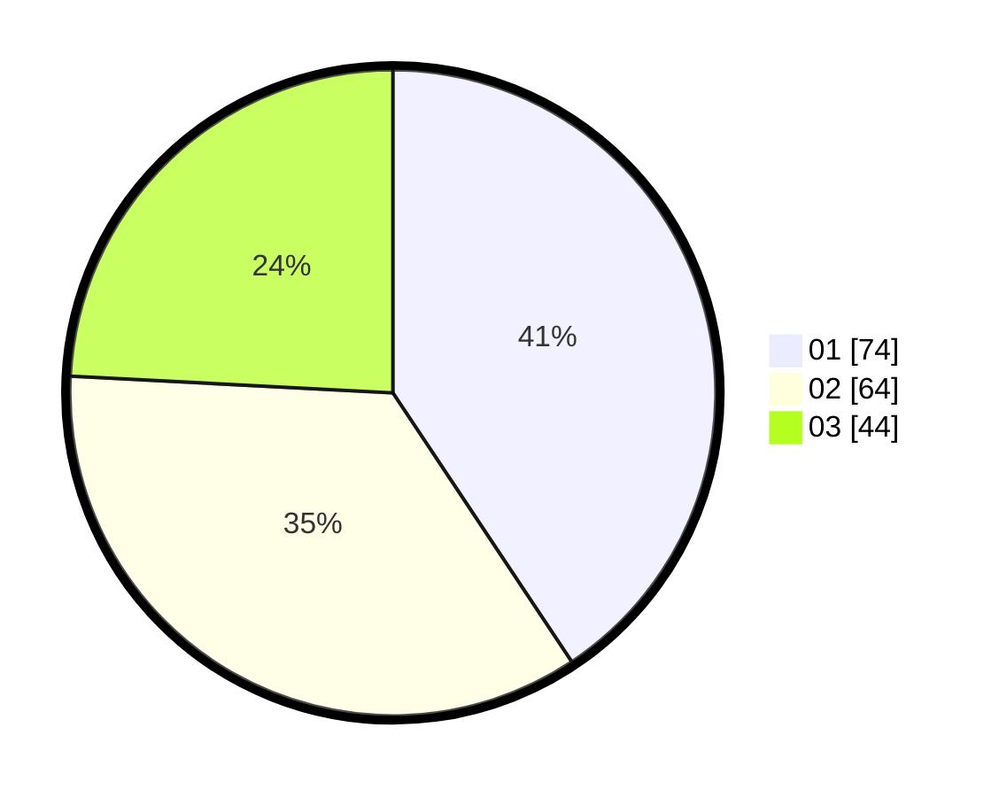

# Hasil

Hasil perolehan suara paslon dapat dilihat pada file paslon-01.txt, paslon-02.txt, dan paslon-03.txt.

Jika tidak ada, artinya data tersebut belum ada pada SIREKAP.

## Perolehan Suara

 * Paslon 01: **74**.
 * Paslon 02: **64**.
 * Paslon 03: **44**.

## Foto C Plano

https://sirekap-obj-formc.kpu.go.id/46c8/pemilu/ppwp/31/74/03/10/02/3174031002064-20240216-034029--022f1cda-47bd-4806-bc2a-edddd35edda6.jpg

https://sirekap-obj-formc.kpu.go.id/46c8/pemilu/ppwp/31/74/03/10/02/3174031002064-20240216-034035--55b844eb-54f3-45ec-8826-6bd1ed5ffbc8.jpg

https://sirekap-obj-formc.kpu.go.id/46c8/pemilu/ppwp/31/74/03/10/02/3174031002064-20240216-034030--4cb5f7a8-f561-4804-8c70-79101bcc725f.jpg

## DATA PEMILIH TETAP

Jumlah pemilih dalam DPT: **215**.
 * L: **106**.
 * P: **109**.

## DATA PENGGUNA HAK PILIH

Jumlah pengguna hak pilih dalam DPT: **180**.
 * L: **87**.
 * P: **93**.

Jumlah pengguna hak pilih dalam DPTb: **5**.
 * L: **3**.
 * P: **2**.

Jumlah pengguna hak pilih dalam DPK: **0**.
 * L: **0**.
 * P: **0**.

Jumlah pengguna hak pilih: **185**.
 * L: **90**.
 * P: **95**.

## JUMLAH SUARA SAH DAN TIDAK SAH

JUMLAH SELURUH SUARA SAH: **182**.

JUMLAH SUARA TIDAK SAH: **5**.

JUMLAH SELURUH SUARA SAH DAN SUARA TIDAK SAH: **187**.
