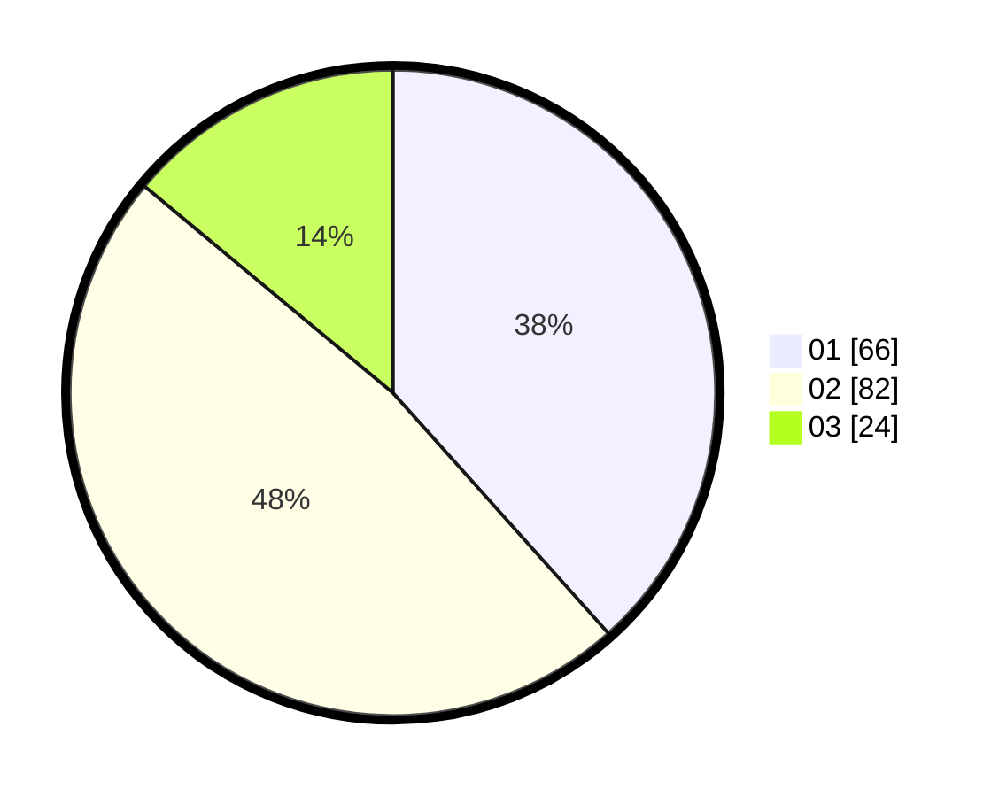

# Hasil

Hasil perolehan suara paslon dapat dilihat pada file paslon-01.txt, paslon-02.txt, dan paslon-03.txt.

Jika tidak ada, artinya data tersebut belum ada pada SIREKAP.

## Perolehan Suara

 * Paslon 01: **66**.
 * Paslon 02: **82**.
 * Paslon 03: **24**.

## Foto C Plano

https://sirekap-obj-formc.kpu.go.id/6f00/pemilu/ppwp/31/74/03/10/02/3174031002067-20240216-033034--f0088318-95bc-42bf-9636-b84d6f9d20b7.jpg

https://sirekap-obj-formc.kpu.go.id/6f00/pemilu/ppwp/31/74/03/10/02/3174031002067-20240216-033036--869953d1-6b59-473e-8e49-a86d13cd7fbc.jpg

https://sirekap-obj-formc.kpu.go.id/6f00/pemilu/ppwp/31/74/03/10/02/3174031002067-20240216-042739--a0451c41-4d61-460b-a3fb-59c2ef1d9dd0.jpg

## DATA PEMILIH TETAP

Jumlah pemilih dalam DPT: **206**.
 * L: **95**.
 * P: **111**.

## DATA PENGGUNA HAK PILIH

Jumlah pengguna hak pilih dalam DPT: **159**.
 * L: **71**.
 * P: **88**.

Jumlah pengguna hak pilih dalam DPTb: **9**.
 * L: **5**.
 * P: **4**.

Jumlah pengguna hak pilih dalam DPK: **4**.
 * L: **1**.
 * P: **3**.

Jumlah pengguna hak pilih: **172**.
 * L: **77**.
 * P: **95**.

## JUMLAH SUARA SAH DAN TIDAK SAH

JUMLAH SELURUH SUARA SAH: **172**.

JUMLAH SUARA TIDAK SAH: **0**.

JUMLAH SELURUH SUARA SAH DAN SUARA TIDAK SAH: **172**.
