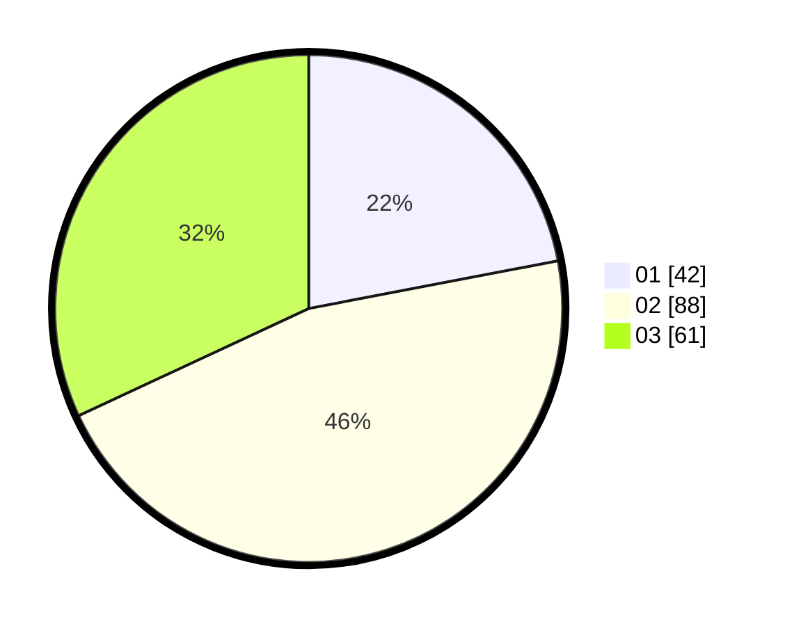

# Hasil

Hasil perolehan suara paslon dapat dilihat pada file paslon-01.txt, paslon-02.txt, dan paslon-03.txt.

Jika tidak ada, artinya data tersebut belum ada pada SIREKAP.

## Perolehan Suara

 * Paslon 01: **42**.
 * Paslon 02: **88**.
 * Paslon 03: **61**.

## Foto C Plano

https://sirekap-obj-formc.kpu.go.id/d27e/pemilu/ppwp/31/74/03/10/02/3174031002077-20240216-030335--abae5ff8-5049-4a93-ad6a-4b969ef37367.jpg

https://sirekap-obj-formc.kpu.go.id/d27e/pemilu/ppwp/31/74/03/10/02/3174031002077-20240216-025459--edde42fc-dd61-4dcc-aace-3d4a7015ff9b.jpg

https://sirekap-obj-formc.kpu.go.id/d27e/pemilu/ppwp/31/74/03/10/02/3174031002077-20240216-025442--922a9c7a-ece4-4353-81f8-148ec6da8054.jpg

## DATA PEMILIH TETAP

Jumlah pemilih dalam DPT: **214**.
 * L: **104**.
 * P: **110**.

## DATA PENGGUNA HAK PILIH

Jumlah pengguna hak pilih dalam DPT: **180**.
 * L: **85**.
 * P: **95**.

Jumlah pengguna hak pilih dalam DPTb: **6**.
 * L: **2**.
 * P: **4**.

Jumlah pengguna hak pilih dalam DPK: **6**.
 * L: **2**.
 * P: **4**.

Jumlah pengguna hak pilih: **192**.
 * L: **89**.
 * P: **103**.

## JUMLAH SUARA SAH DAN TIDAK SAH

JUMLAH SELURUH SUARA SAH: **191**.

JUMLAH SUARA TIDAK SAH: **1**.

JUMLAH SELURUH SUARA SAH DAN SUARA TIDAK SAH: **192**.
