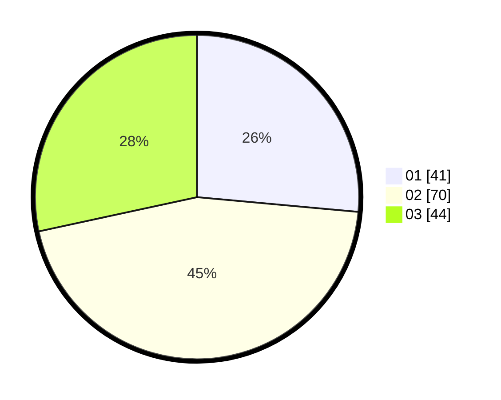

# Hasil

Hasil perolehan suara paslon dapat dilihat pada file paslon-01.txt, paslon-02.txt, dan paslon-03.txt.

Jika tidak ada, artinya data tersebut belum ada pada SIREKAP.

## Perolehan Suara

 * Paslon 01: **41**.
 * Paslon 02: **70**.
 * Paslon 03: **44**.

## Foto C Plano

https://sirekap-obj-formc.kpu.go.id/588f/pemilu/ppwp/31/74/03/10/02/3174031002078-20240215-215715--95ee9d27-13f5-4bf8-a5e3-d70a620a3733.jpg

https://sirekap-obj-formc.kpu.go.id/588f/pemilu/ppwp/31/74/03/10/02/3174031002078-20240215-215716--883c6321-8e68-43d1-9f89-0b3c494303b9.jpg

https://sirekap-obj-formc.kpu.go.id/588f/pemilu/ppwp/31/74/03/10/02/3174031002078-20240215-215715--337a8193-1ae5-4308-afb4-be9c39a1563a.jpg

## DATA PEMILIH TETAP

Jumlah pemilih dalam DPT: **215**.
 * L: **113**.
 * P: **102**.

## DATA PENGGUNA HAK PILIH

Jumlah pengguna hak pilih dalam DPT: **154**.
 * L: **80**.
 * P: **74**.

Jumlah pengguna hak pilih dalam DPTb: **4**.
 * L: **0**.
 * P: **4**.

Jumlah pengguna hak pilih dalam DPK: **1**.
 * L: **0**.
 * P: **1**.

Jumlah pengguna hak pilih: **159**.
 * L: **80**.
 * P: **79**.

## JUMLAH SUARA SAH DAN TIDAK SAH

JUMLAH SELURUH SUARA SAH: **155**.

JUMLAH SUARA TIDAK SAH: **4**.

JUMLAH SELURUH SUARA SAH DAN SUARA TIDAK SAH: **159**.
