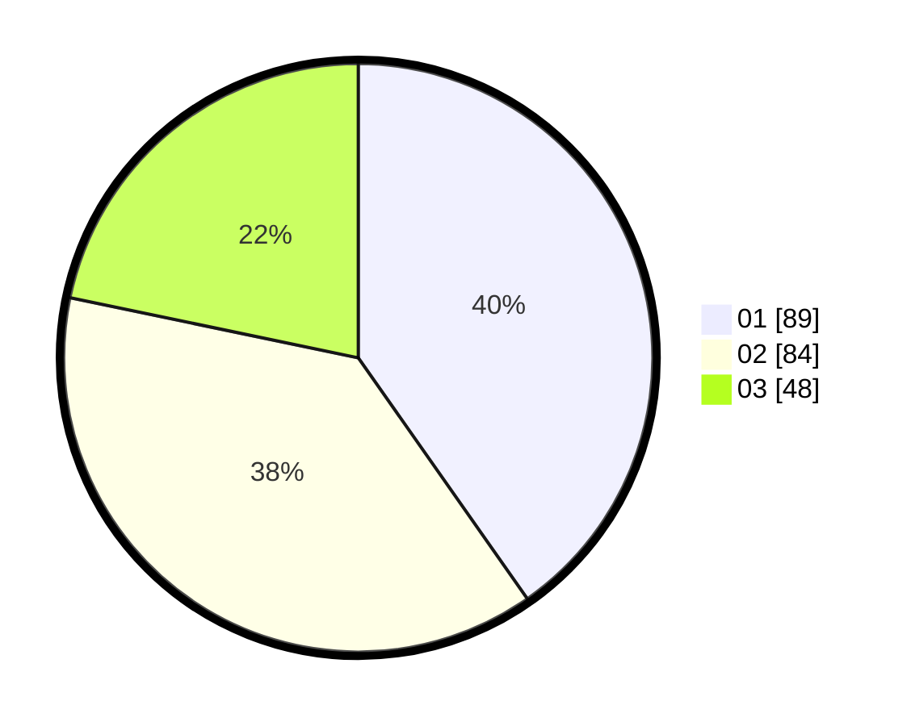

# Hasil

Hasil perolehan suara paslon dapat dilihat pada file paslon-01.txt, paslon-02.txt, dan paslon-03.txt.

Jika tidak ada, artinya data tersebut belum ada pada SIREKAP.

## Perolehan Suara

 * Paslon 01: **89**.
 * Paslon 02: **84**.
 * Paslon 03: **48**.

## Foto C Plano

https://sirekap-obj-formc.kpu.go.id/690e/pemilu/ppwp/31/74/03/10/03/3174031003002-20240216-195338--1ee3d615-6c06-4fdd-a2b6-450e53871e12.jpg

https://sirekap-obj-formc.kpu.go.id/690e/pemilu/ppwp/31/74/03/10/03/3174031003002-20240216-195501--222939d7-bd36-46eb-96fb-af9a1f846021.jpg

https://sirekap-obj-formc.kpu.go.id/690e/pemilu/ppwp/31/74/03/10/03/3174031003002-20240216-195524--371079a8-42c5-451f-acb0-ad22f1d8c5db.jpg

## DATA PEMILIH TETAP

Jumlah pemilih dalam DPT: **290**.
 * L: **145**.
 * P: **145**.

## DATA PENGGUNA HAK PILIH

Jumlah pengguna hak pilih dalam DPT: **208**.
 * L: **98**.
 * P: **110**.

Jumlah pengguna hak pilih dalam DPTb: **8**.
 * L: **3**.
 * P: **5**.

Jumlah pengguna hak pilih dalam DPK: **5**.
 * L: **3**.
 * P: **2**.

Jumlah pengguna hak pilih: **221**.
 * L: **104**.
 * P: **117**.

## JUMLAH SUARA SAH DAN TIDAK SAH

JUMLAH SELURUH SUARA SAH: **221**.

JUMLAH SUARA TIDAK SAH: **0**.

JUMLAH SELURUH SUARA SAH DAN SUARA TIDAK SAH: **221**.
