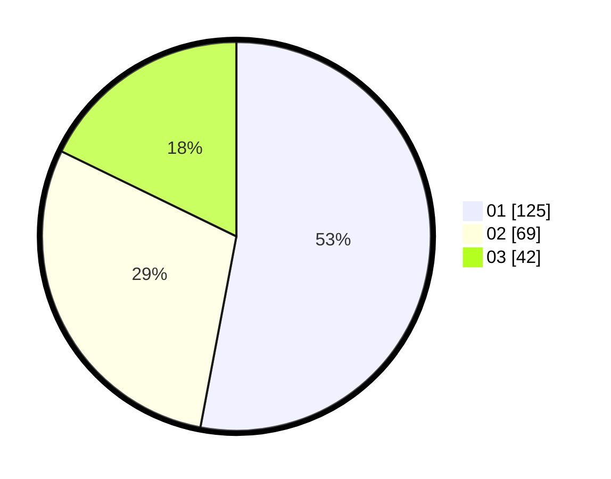

# Hasil

Hasil perolehan suara paslon dapat dilihat pada file paslon-01.txt, paslon-02.txt, dan paslon-03.txt.

Jika tidak ada, artinya data tersebut belum ada pada SIREKAP.

## Perolehan Suara

 * Paslon 01: **125**.
 * Paslon 02: **69**.
 * Paslon 03: **42**.

## Foto C Plano

https://sirekap-obj-formc.kpu.go.id/5bdd/pemilu/ppwp/31/74/03/10/03/3174031003003-20240214-185349--b122e8b8-2a1f-41b9-9055-e9169d2ba6c3.jpg

https://sirekap-obj-formc.kpu.go.id/5bdd/pemilu/ppwp/31/74/03/10/03/3174031003003-20240214-185341--447781fc-66f3-4d20-890a-5dbd07cf01f4.jpg

https://sirekap-obj-formc.kpu.go.id/5bdd/pemilu/ppwp/31/74/03/10/03/3174031003003-20240214-184458--8cceb2df-1f8a-4777-b27b-3571f7107ae4.jpg

## DATA PEMILIH TETAP

Jumlah pemilih dalam DPT: **289**.
 * L: **147**.
 * P: **142**.

## DATA PENGGUNA HAK PILIH

Jumlah pengguna hak pilih dalam DPT: **221**.
 * L: **112**.
 * P: **109**.

Jumlah pengguna hak pilih dalam DPTb: **15**.
 * L: **6**.
 * P: **9**.

Jumlah pengguna hak pilih dalam DPK: **1**.
 * L: **1**.
 * P: **0**.

Jumlah pengguna hak pilih: **237**.
 * L: **119**.
 * P: **118**.

## JUMLAH SUARA SAH DAN TIDAK SAH

JUMLAH SELURUH SUARA SAH: **236**.

JUMLAH SUARA TIDAK SAH: **1**.

JUMLAH SELURUH SUARA SAH DAN SUARA TIDAK SAH: **237**.
