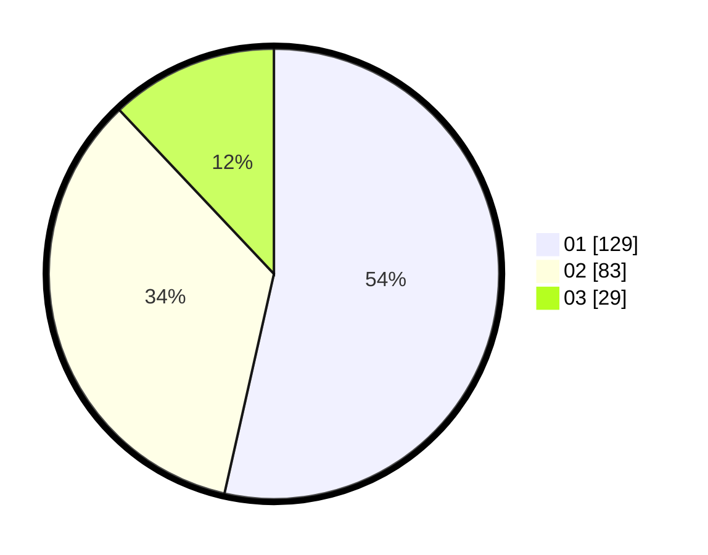

# Hasil

Hasil perolehan suara paslon dapat dilihat pada file paslon-01.txt, paslon-02.txt, dan paslon-03.txt.

Jika tidak ada, artinya data tersebut belum ada pada SIREKAP.

## Perolehan Suara

 * Paslon 01: **129**.
 * Paslon 02: **83**.
 * Paslon 03: **29**.

## Foto C Plano

https://sirekap-obj-formc.kpu.go.id/c527/pemilu/ppwp/31/74/03/10/03/3174031003005-20240214-193539--cf5cc45a-ee81-4c7e-988d-551f09d44e71.jpg

https://sirekap-obj-formc.kpu.go.id/c527/pemilu/ppwp/31/74/03/10/03/3174031003005-20240214-193544--014d3059-2b8a-47b7-bddb-082c548ccba6.jpg

https://sirekap-obj-formc.kpu.go.id/c527/pemilu/ppwp/31/74/03/10/03/3174031003005-20240214-193548--47d2bd11-dcc9-40c7-8cfe-b19256de9f77.jpg

## DATA PEMILIH TETAP

Jumlah pemilih dalam DPT: **281**.
 * L: **137**.
 * P: **144**.

## DATA PENGGUNA HAK PILIH

Jumlah pengguna hak pilih dalam DPT: **231**.
 * L: **113**.
 * P: **118**.

Jumlah pengguna hak pilih dalam DPTb: **12**.
 * L: **2**.
 * P: **10**.

Jumlah pengguna hak pilih dalam DPK: **2**.
 * L: **0**.
 * P: **2**.

Jumlah pengguna hak pilih: **245**.
 * L: **115**.
 * P: **130**.

## JUMLAH SUARA SAH DAN TIDAK SAH

JUMLAH SELURUH SUARA SAH: **241**.

JUMLAH SUARA TIDAK SAH: **4**.

JUMLAH SELURUH SUARA SAH DAN SUARA TIDAK SAH: **245**.
