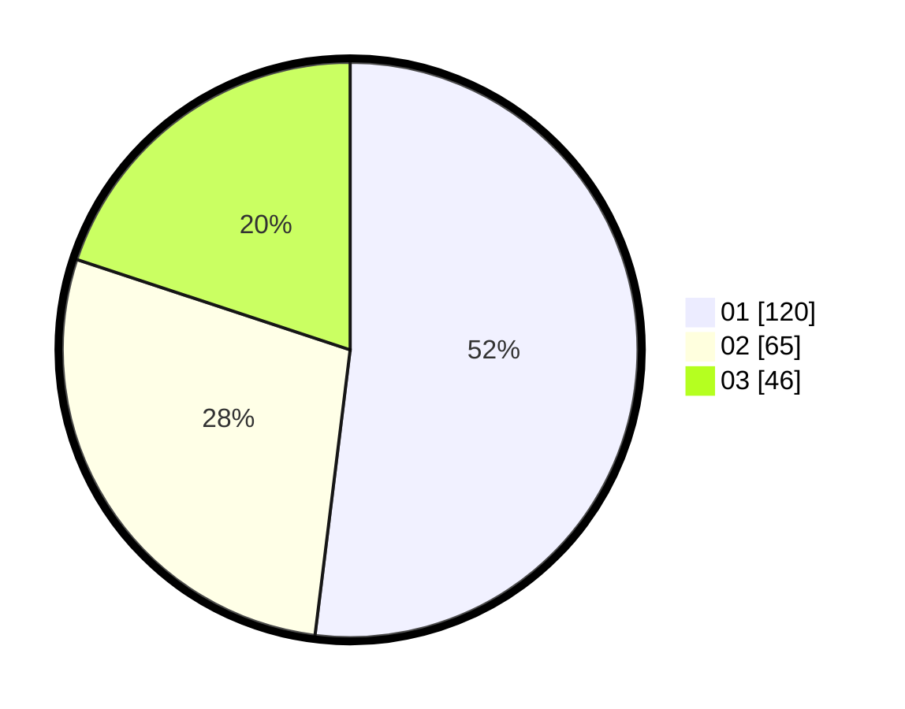

# Hasil

Hasil perolehan suara paslon dapat dilihat pada file paslon-01.txt, paslon-02.txt, dan paslon-03.txt.

Jika tidak ada, artinya data tersebut belum ada pada SIREKAP.

## Perolehan Suara

 * Paslon 01: **120**.
 * Paslon 02: **65**.
 * Paslon 03: **46**.

## Foto C Plano

https://sirekap-obj-formc.kpu.go.id/7cb5/pemilu/ppwp/31/74/03/10/03/3174031003010-20240217-115752--a7cd9f0c-4ad7-4117-ab7a-025fc15453a8.jpg

https://sirekap-obj-formc.kpu.go.id/7cb5/pemilu/ppwp/31/74/03/10/03/3174031003010-20240217-120107--e419ac70-04a4-419b-9c04-ba5c9eaadd4e.jpg

https://sirekap-obj-formc.kpu.go.id/7cb5/pemilu/ppwp/31/74/03/10/03/3174031003010-20240217-115634--b0e80d95-4769-4988-92f8-9387ffdb2deb.jpg

## DATA PEMILIH TETAP

Jumlah pemilih dalam DPT: **261**.
 * L: **117**.
 * P: **144**.

## DATA PENGGUNA HAK PILIH

Jumlah pengguna hak pilih dalam DPT: **228**.
 * L: **94**.
 * P: **134**.

Jumlah pengguna hak pilih dalam DPTb: **7**.
 * L: **2**.
 * P: **5**.

Jumlah pengguna hak pilih dalam DPK: **0**.
 * L: **0**.
 * P: **0**.

Jumlah pengguna hak pilih: **235**.
 * L: **96**.
 * P: **139**.

## JUMLAH SUARA SAH DAN TIDAK SAH

JUMLAH SELURUH SUARA SAH: **231**.

JUMLAH SUARA TIDAK SAH: **4**.

JUMLAH SELURUH SUARA SAH DAN SUARA TIDAK SAH: **235**.
