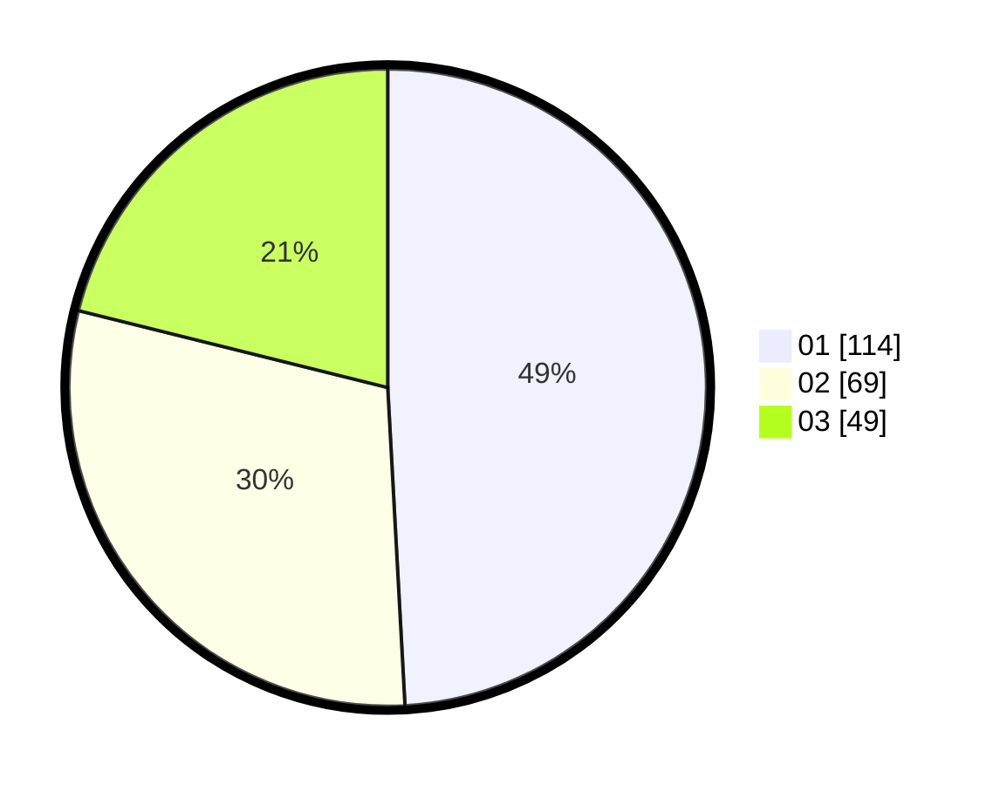

# Hasil

Hasil perolehan suara paslon dapat dilihat pada file paslon-01.txt, paslon-02.txt, dan paslon-03.txt.

Jika tidak ada, artinya data tersebut belum ada pada SIREKAP.

## Perolehan Suara

 * Paslon 01: **114**.
 * Paslon 02: **69**.
 * Paslon 03: **49**.

## Foto C Plano

https://sirekap-obj-formc.kpu.go.id/ee24/pemilu/ppwp/31/74/03/10/03/3174031003011-20240216-124234--98287547-4636-40c9-bd8b-6450332a6705.jpg

https://sirekap-obj-formc.kpu.go.id/ee24/pemilu/ppwp/31/74/03/10/03/3174031003011-20240216-124244--6b26d0d8-4742-44ed-bb3a-aef00f054514.jpg

https://sirekap-obj-formc.kpu.go.id/ee24/pemilu/ppwp/31/74/03/10/03/3174031003011-20240216-124241--1bf86229-9ac0-4305-83cb-05153a38683c.jpg

## DATA PEMILIH TETAP

Jumlah pemilih dalam DPT: **268**.
 * L: **125**.
 * P: **143**.

## DATA PENGGUNA HAK PILIH

Jumlah pengguna hak pilih dalam DPT: **230**.
 * L: **104**.
 * P: **126**.

Jumlah pengguna hak pilih dalam DPTb: **11**.
 * L: **5**.
 * P: **6**.

Jumlah pengguna hak pilih dalam DPK: **0**.
 * L: **0**.
 * P: **0**.

Jumlah pengguna hak pilih: **241**.
 * L: **109**.
 * P: **132**.

## JUMLAH SUARA SAH DAN TIDAK SAH

JUMLAH SELURUH SUARA SAH: **232**.

JUMLAH SUARA TIDAK SAH: **9**.

JUMLAH SELURUH SUARA SAH DAN SUARA TIDAK SAH: **241**.
