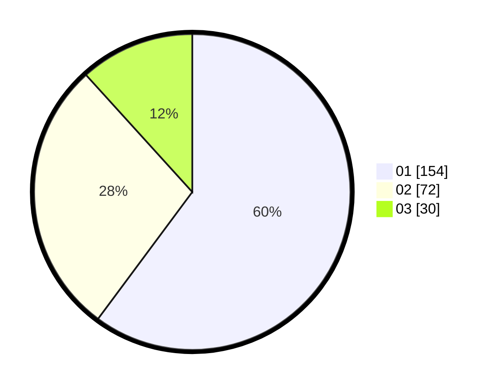

# Hasil

Hasil perolehan suara paslon dapat dilihat pada file paslon-01.txt, paslon-02.txt, dan paslon-03.txt.

Jika tidak ada, artinya data tersebut belum ada pada SIREKAP.

## Perolehan Suara

 * Paslon 01: **154**.
 * Paslon 02: **72**.
 * Paslon 03: **30**.

## Foto C Plano

https://sirekap-obj-formc.kpu.go.id/c457/pemilu/ppwp/31/74/03/10/03/3174031003012-20240216-094600--b75cecaa-a9c4-4c51-96fd-96a1cf3aef10.jpg

https://sirekap-obj-formc.kpu.go.id/c457/pemilu/ppwp/31/74/03/10/03/3174031003012-20240214-214359--e2e78382-acb2-4f46-8fda-e11df450c845.jpg

https://sirekap-obj-formc.kpu.go.id/c457/pemilu/ppwp/31/74/03/10/03/3174031003012-20240214-214447--2bf42623-8246-4118-8c04-bc22df3a213d.jpg
