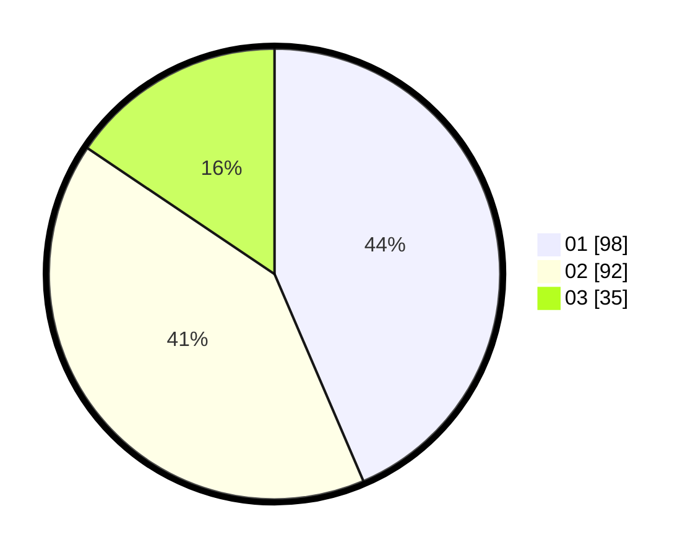

# Hasil

Hasil perolehan suara paslon dapat dilihat pada file paslon-01.txt, paslon-02.txt, dan paslon-03.txt.

Jika tidak ada, artinya data tersebut belum ada pada SIREKAP.

## Perolehan Suara

 * Paslon 01: **98**.
 * Paslon 02: **92**.
 * Paslon 03: **35**.

## Foto C Plano

https://sirekap-obj-formc.kpu.go.id/a756/pemilu/ppwp/31/74/03/10/03/3174031003015-20240217-150132--f347b0b7-59c5-4624-9730-f6bb603149c1.jpg

https://sirekap-obj-formc.kpu.go.id/a756/pemilu/ppwp/31/74/03/10/03/3174031003015-20240217-150555--e1d4ab79-70f4-4e75-bcde-126b5c89ef73.jpg

https://sirekap-obj-formc.kpu.go.id/a756/pemilu/ppwp/31/74/03/10/03/3174031003015-20240217-150719--2750013f-6528-4ed2-b275-77a173ee1337.jpg

## DATA PEMILIH TETAP

Jumlah pemilih dalam DPT: **278**.
 * L: **137**.
 * P: **141**.

## DATA PENGGUNA HAK PILIH

Jumlah pengguna hak pilih dalam DPT: **217**.
 * L: **102**.
 * P: **115**.

Jumlah pengguna hak pilih dalam DPTb: **6**.
 * L: **2**.
 * P: **4**.

Jumlah pengguna hak pilih dalam DPK: **7**.
 * L: **3**.
 * P: **4**.

Jumlah pengguna hak pilih: **230**.
 * L: **107**.
 * P: **123**.

## JUMLAH SUARA SAH DAN TIDAK SAH

JUMLAH SELURUH SUARA SAH: **225**.

JUMLAH SUARA TIDAK SAH: **5**.

JUMLAH SELURUH SUARA SAH DAN SUARA TIDAK SAH: **230**.
