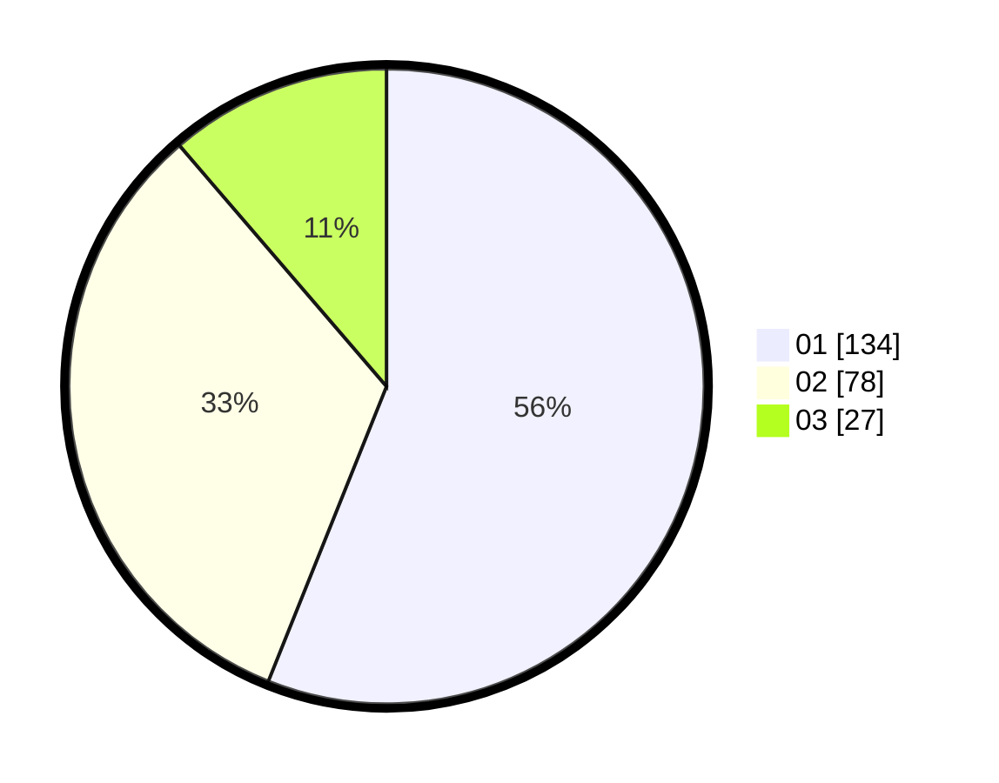

# Hasil

Hasil perolehan suara paslon dapat dilihat pada file paslon-01.txt, paslon-02.txt, dan paslon-03.txt.

Jika tidak ada, artinya data tersebut belum ada pada SIREKAP.

## Perolehan Suara

 * Paslon 01: **134**.
 * Paslon 02: **78**.
 * Paslon 03: **27**.

## Foto C Plano

https://sirekap-obj-formc.kpu.go.id/cd25/pemilu/ppwp/31/74/03/10/03/3174031003029-20240214-222409--d3f6c00e-69c6-496f-93c4-48e42194ccfe.jpg

https://sirekap-obj-formc.kpu.go.id/cd25/pemilu/ppwp/31/74/03/10/03/3174031003029-20240214-233722--c484df26-6bb4-4f61-88e7-f466a7185c27.jpg

https://sirekap-obj-formc.kpu.go.id/cd25/pemilu/ppwp/31/74/03/10/03/3174031003029-20240216-133259--07b097d8-6953-4968-adbc-0a8a6033c950.jpg
