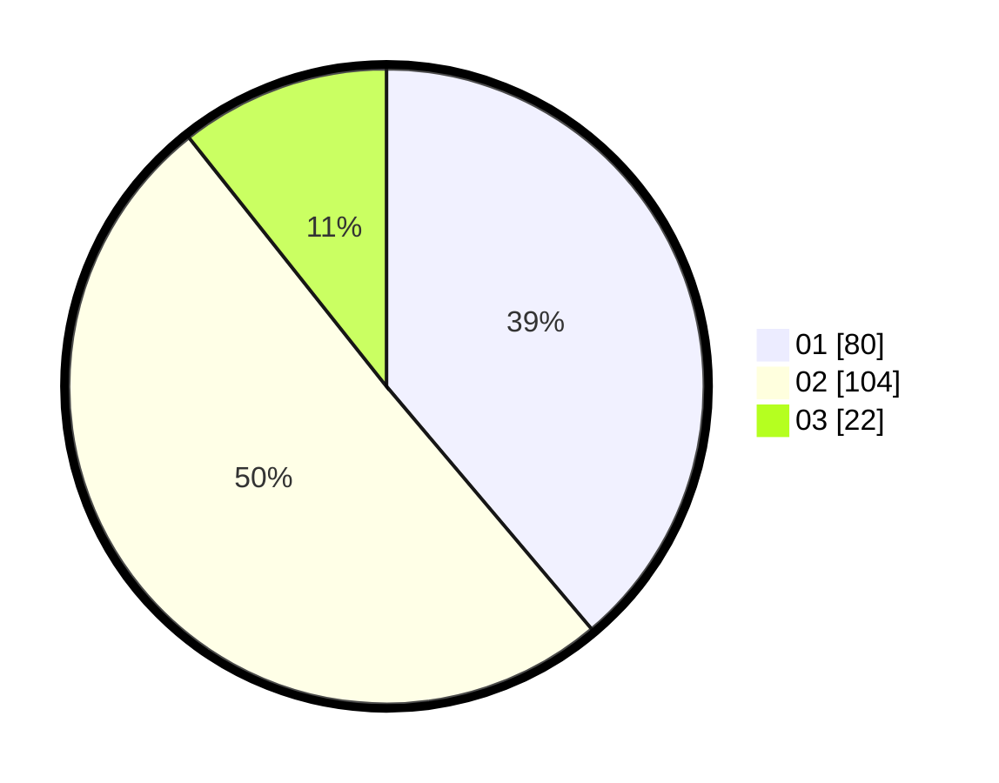

# Hasil

Hasil perolehan suara paslon dapat dilihat pada file paslon-01.txt, paslon-02.txt, dan paslon-03.txt.

Jika tidak ada, artinya data tersebut belum ada pada SIREKAP.

## Perolehan Suara

 * Paslon 01: **80**.
 * Paslon 02: **104**.
 * Paslon 03: **22**.

## Foto C Plano

https://sirekap-obj-formc.kpu.go.id/5fbd/pemilu/ppwp/31/74/03/10/03/3174031003054-20240214-190204--8525a15e-3161-4860-b760-e7ae8194d3c6.jpg

https://sirekap-obj-formc.kpu.go.id/5fbd/pemilu/ppwp/31/74/03/10/03/3174031003054-20240214-194612--d1728b3b-66de-49e9-9c3a-9ddb34d6236b.jpg

https://sirekap-obj-formc.kpu.go.id/5fbd/pemilu/ppwp/31/74/03/10/03/3174031003054-20240214-190535--a9e1a5be-5bba-41b3-9bb9-3ca1437178a6.jpg

## DATA PEMILIH TETAP

Jumlah pemilih dalam DPT: **270**.
 * L: **124**.
 * P: **146**.

## DATA PENGGUNA HAK PILIH

Jumlah pengguna hak pilih dalam DPT: **203**.
 * L: **92**.
 * P: **111**.

Jumlah pengguna hak pilih dalam DPTb: **5**.
 * L: **3**.
 * P: **2**.

Jumlah pengguna hak pilih dalam DPK: **1**.
 * L: **1**.
 * P: **0**.

Jumlah pengguna hak pilih: **209**.
 * L: **0**.
 * P: **0**.

## JUMLAH SUARA SAH DAN TIDAK SAH

JUMLAH SELURUH SUARA SAH: **206**.

JUMLAH SUARA TIDAK SAH: **3**.

JUMLAH SELURUH SUARA SAH DAN SUARA TIDAK SAH: **209**.
