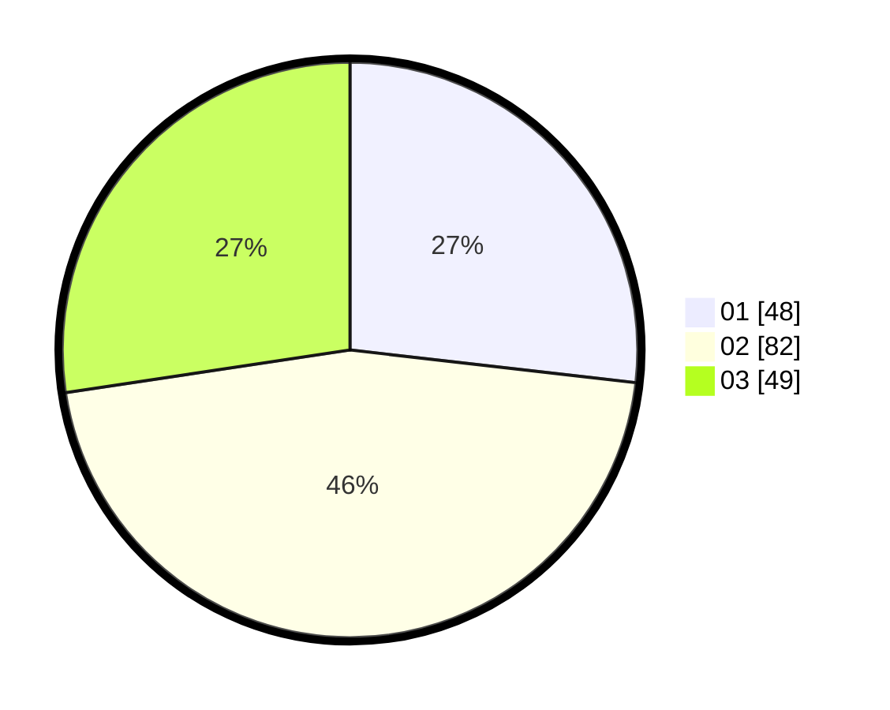

# Hasil

Hasil perolehan suara paslon dapat dilihat pada file paslon-01.txt, paslon-02.txt, dan paslon-03.txt.

Jika tidak ada, artinya data tersebut belum ada pada SIREKAP.

## Perolehan Suara

 * Paslon 01: **48**.
 * Paslon 02: **82**.
 * Paslon 03: **49**.

## Foto C Plano

https://sirekap-obj-formc.kpu.go.id/4a45/pemilu/ppwp/31/74/03/10/03/3174031003066-20240215-002438--f680c24f-14f4-409f-8d69-788724962f6b.jpg

https://sirekap-obj-formc.kpu.go.id/4a45/pemilu/ppwp/31/74/03/10/03/3174031003066-20240215-002542--036739a8-8a3f-4f4a-8c2e-b4aa0078b8d6.jpg

https://sirekap-obj-formc.kpu.go.id/4a45/pemilu/ppwp/31/74/03/10/03/3174031003066-20240215-002643--354f0c9e-9701-4a7c-873e-8c68b25cd21b.jpg

## DATA PEMILIH TETAP

Jumlah pemilih dalam DPT: **169**.
 * L: **78**.
 * P: **91**.

## DATA PENGGUNA HAK PILIH

Jumlah pengguna hak pilih dalam DPT: **169**.
 * L: **78**.
 * P: **91**.

Jumlah pengguna hak pilih dalam DPTb: **11**.
 * L: **3**.
 * P: **8**.

Jumlah pengguna hak pilih dalam DPK: **7**.
 * L: **1**.
 * P: **6**.

Jumlah pengguna hak pilih: **187**.
 * L: **82**.
 * P: **105**.

## JUMLAH SUARA SAH DAN TIDAK SAH

JUMLAH SELURUH SUARA SAH: **179**.

JUMLAH SUARA TIDAK SAH: **8**.

JUMLAH SELURUH SUARA SAH DAN SUARA TIDAK SAH: **187**.
