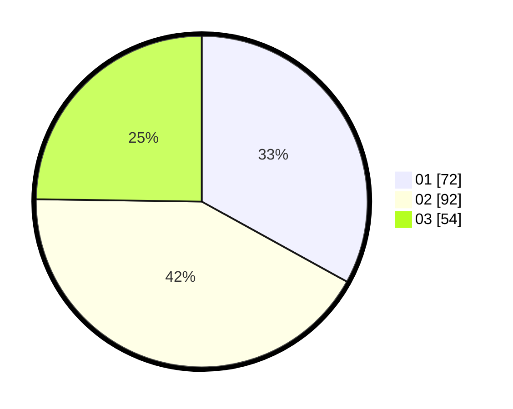

# Hasil

Hasil perolehan suara paslon dapat dilihat pada file paslon-01.txt, paslon-02.txt, dan paslon-03.txt.

Jika tidak ada, artinya data tersebut belum ada pada SIREKAP.

## Perolehan Suara

 * Paslon 01: **72**.
 * Paslon 02: **92**.
 * Paslon 03: **54**.

## Foto C Plano

https://sirekap-obj-formc.kpu.go.id/d929/pemilu/ppwp/31/74/03/10/03/3174031003067-20240214-194022--1b762957-b557-4e16-b0e6-c671efe64a5c.jpg

https://sirekap-obj-formc.kpu.go.id/d929/pemilu/ppwp/31/74/03/10/03/3174031003067-20240214-202400--0678dc85-428e-49d1-86ac-dd8c29c2ea36.jpg

https://sirekap-obj-formc.kpu.go.id/d929/pemilu/ppwp/31/74/03/10/03/3174031003067-20240214-202407--a5e32711-f4ea-4fe7-adea-885d84513b7d.jpg

## DATA PEMILIH TETAP

Jumlah pemilih dalam DPT: **251**.
 * L: **109**.
 * P: **142**.

## DATA PENGGUNA HAK PILIH

Jumlah pengguna hak pilih dalam DPT: **210**.
 * L: **88**.
 * P: **122**.

Jumlah pengguna hak pilih dalam DPTb: **12**.
 * L: **5**.
 * P: **7**.

Jumlah pengguna hak pilih dalam DPK: **2**.
 * L: **0**.
 * P: **2**.

Jumlah pengguna hak pilih: **224**.
 * L: **93**.
 * P: **131**.

## JUMLAH SUARA SAH DAN TIDAK SAH

JUMLAH SELURUH SUARA SAH: **218**.

JUMLAH SUARA TIDAK SAH: **6**.

JUMLAH SELURUH SUARA SAH DAN SUARA TIDAK SAH: **224**.
